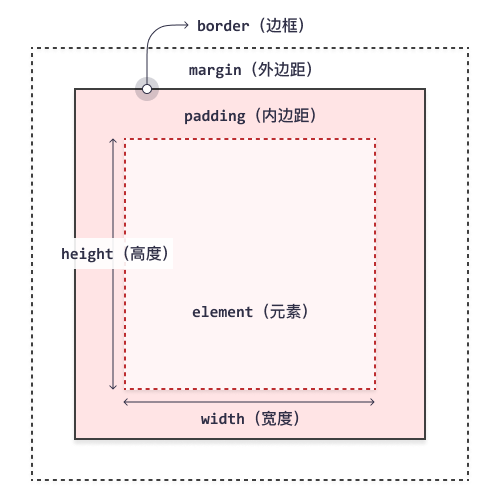

# 一、笔记

1. https://developer.mozilla.org/en-US/docs/Web/CSS

1. CSS 全称 Cascading Style Sheets，层叠样式表。

1. CSS 规则由选择器和声明块组成。

1. 应用样式的三种方法：
    - 外部：在 HTML 页面 head 标签内定义：`<link rel="stylesheet" type="text/css" href="mystyle.css">`
    - 内部：HTML 页面的 head 标签内的 style 中定义。
    - 行内：使用标签的 style 属性。

1. 样式层叠顺序：
    - 浏览器默认样式。
    - 外部和内部样式表（在 head 部分）。
    - 行内样式（在 HTML 元素中）。

1. 样式层叠顺序相同时，以特异性区分，应用区别度最高的样式。相同特异性，按先后顺序，后者覆盖前者样式。
    - id。
    - 类、属性和伪类。
    - 元素和伪元素。

1. 在属性值后加上 !important 表示提升属性的优先级，属性值被优先应用。

1. 注释：以 /* 开始，以 */ 结束。

1. 外边距合并，相邻的外边距会合并成一个，取宽度最大的一个。行内框、浮动框或绝对定位之间的外边距不会合并。

1. 属性值多个值设置的规则，一个值指定四个方向属性值，两个值分别指定上下和左右方向属性值，三个值分别指定上、左右和下方向值，四个值分别指定上、右、下和左方向属性值。

1. 盒子模型：

1. 块元素总是新一行开始，并占据可用的全部宽度。行内元素不从新行开始，并只占用所需的宽度。

1. 实体。两个字节字符，每四位转成十六进制表示。
     ```css
     h1:after {
         content: " \00A7";
     }
     ```

# 二、选择器

1. 多个选择器空格间隔声明，表示交集选择。而逗号分割选择器声明，表示并集选择。

## 三、简单选择器

1. **#*id***：选择元素 Id 等于 *id* 的元素。Id 名称不能以数字开头。
1. **.*class***：选择元素类等于 *class* 的元素。类名不能以数字开头。
1. **.*class1*.*class2***：选择父元素类为 *class1* 且子元素类为 *class2* 的子元素。
1. **\***：选择所有 HTML 标签。

## 四、属性选择器

1. **[*attribute*]**：选择具有 *attribte* 属性的元素。
1. **[*attribute*="*value*"]**：选择具有 *attribte* 属性且值为 *value* 的元素。
1. **[*attribute*~="*value*"]**：选择属性 *attribute* 的值中包含单词 *value* 的元素。
1. **[*attribute*|="*value*"]**：选择属性 *attribute* 的值中以单词 *value* 开头的元素。
1. **[*attribute*^="*value*"]**：选择属性 *attribute* 的值中以字符 *value* 开头的元素。
1. **[*attribute*$="*value*"]**：选择属性 *attribute* 的值中以字符 *value* 结尾的元素。
1. **[*attribute*\*="*value*"]**：选择属性 *attribute* 的值中包含字符 *value* 的元素。

## 五、伪类选择器

1. **:active**：选择被选中的链接元素。
1. **:hover**：选择鼠标浮动在上面的元素。
1. **:link**：选择未被访问过的链接元素。
1. **:visited**：选择被访问过的链接元素。
1. **:checked**：选择单/复选框中被选中的元素。
1. **:indeterminate**：选择处于不确定状态的输入框元素。
1. **:disabled**：选择被禁用的输入框元素。
1. **:enabled**：选择启用了的输入框元素。
1. **:focus**：选择获得输入焦点的输入框元素。
1. **:in-range**：选择具有输入范围的，值在合法范围内的输入框元素。
1. **:out-of-range**：选择具有输入范围的，值不在合法范围内的输入框元素。
1. **:invalid**：选择输入值非法的输入框元素。
1. **:default**：选择是默认值的输入框元素。
1. **:valid**：选择输入值合法的输入框元素。
1. **:read-only**：选择只读的输入框元素。
1. **:read-write**：选择没有设置只读的输入框元素。
1. **:optional**：选择可选输入的输入框元素。
1. **:required**：选择必填的输入框元素。
1. **:first-child**：选择是首个的直接子元素的元素。
1. **:last-child**：选择是最后一个的直接子元素的元素。
1. **:first-of-type**：选择是首个该类型的直接子元素的元素。
1. **:last-of-type**：选择是最后一个该类型的直接子元素的元素。
1. **:nth-child(*n* | odd | even | *a*n+*b*)**：选择是指定数位次序的直接子元素的元素。
1. **:nth-last-child(*n* | odd | even | *a*n+*b*)**：选择是指定数位次序（倒数）的直接子元素的元素。
1. **:nth-of-type(*n* | odd | even | *a*n+*b*)**：选择是指定数位次序的该元素类型的直接子元素的元素。
1. **:nth-last-of-type(*n* | odd | even | *a*n+*b*)**：选择是指定数位次序（倒数）的该元素类型的直接子元素的元素。
1. **:only-of-type**：选择是该元素类型的唯一的直接子元素的元素。
1. **:only-child**：选择是唯一的直接子元素的元素。
1. **:empty**：选择是空元素的元素。
1. **:lang(*lang*)**：选择 lang 属性是以 *lang* 开头的元素。
1. **:not(*selector*)**：选择非 *selector* 的元素。
1. **:root**：选择根元素。
1. **:target**：选择当前活动的元素。锚跳转到的元素是为活动元素。
1. **:fullscreen**：选择处于全屏幕模式的元素。
1. **:where(*selectors*)**：匹配参数中的选择器元素，但不会增加这些选择器的优先级。

## 六、元素选择器

1. ***element***：选择 *element* 元素。
1. ***element1* *element2***：选取 *element1* 下所有的 *element2* 元素。
1. ***element1*>*element2***：选择直接父元素是 *element1* 的 *element2* 元素。
1. ***element1*+*element2***：选择 *element1* 元素之后的直接兄弟元素 *element2*。
1. ***element1*~*element2***：选择 *element1* 元素之后的兄弟元素 *element2*。

## 七、伪元素选择器

1. **::after**：选择元素之后的区域。
    ```css
    /* 在每个 <p> 元素的内容之后插入新内容 */
    p:after {
        content: "台词：";
    }
    ```
    
1. **::before**：选择元素之前的区域。

1. **::first-letter**：选择元素文本的首字母。

1. **::first-line**：选择元素文本的首行字符。

1. **::selection**：选择被用户选择了的字符。

1. **::placeholder**：选择输入框中的占位符文本。

# 八、属性

1. 全局属性：inherit 继承父元素该属性的值。initial 设置为默认值。

## 1. 背景

- **background**：所有 background-* 属性的简写属性。不继承。属性值类型设置顺序：color、image、position/size、repeat、origin、clip、attachment，可不设置其中的某个值。可以指定多套背景属性，之间逗号分割。

- **background-color**：规定元素的背景色。不继承。颜色会填充元素的内容、内边距和边框区域，扩展到元素边框的外边界（但不包括外边距）。如果边框有透明部分（如虚线边框），会透过这些透明部分显示出背景色。
    - transparent：默认值。背景颜色为透明。
    - *color*
- **background-image**：规定元素的一幅或多幅背景图像。不继承。可多值设置，多个值之间逗号分割。元素的背景占据了元素的全部尺寸，包括内边距和边框，但不包括外边距。默认地，背景图像位于元素的左上角，并在水平和垂直方向上重复。
    - none：默认值。不显示背景图像。
    - url('*URL*')：指定背景图片地址。
- **background-position**：规定背景图像的位置。不继承。可多值设置，多个值之间逗号分割，以对应不同背景图。背景图像如果要重复，将从这一点开始。
    - 0% 0%：默认值。
    - *x*% *y*%：*x* 是水平位置，*y* 是垂直位置。左上角是 0% 0%，仅指定一个值，那么另一个值是 50%。值相对于图片的宽高。
    - *x-pos* *y-pos*：同上，可以混用长度和百分比。
    - *keyword* *keyword*：如果仅指定一个值，那么另一个值是 center。可能值：left、right、top、bottom、center。
- **background-size**：规定背景图像的尺寸。不继承。可多值设置，多个值之间逗号分割，以对应不同背景图。
    - auto：默认值。
    - *wLength* *hLength*：设置高度和宽度。若只设置宽度，则高度为 auto。缩小放大效果。
    - *wPercentage* *hPercentage*：根据父元素的百分比来设置宽度和高度。
    - cover：按图片尺寸覆盖背景。保持长宽比。
    - contain：宽度和高度完全适应内容区域。保持长宽比。
- **background-repeat**：设置是否以及如何重复背景图像。不继承。
    - repeat：默认值。背景图像将在垂直方向和水平方向重复。
    - repeat-x：背景图像将在水平方向重复。
    - repeat-y：背景图像将在垂直方向重复。
    - no-repeat：背景图像将仅显示一次。
- **background-origin**：规定背景图像的初始位置。不继承。若 background-attachment 为 fixed，则该属性没效果。
    - padding-box：默认值。背景图像相对于内边距框来定位。
    - border-box：背景图像相对于边框盒来定位。
    - content-box：背景图像相对于内容框来定位。
- **background-clip**：定义背景（颜色或图像）应在元素内延伸的距离。不继承。
    - border-box：默认值。背景被裁剪到边框盒。
    - padding-box：背景被裁剪到内边距框。
    - content-box：背景被裁剪到内容框。
- **background-attachment**：设置背景图像是与页面的其余部分一起滚动还是固定的。不继承。
    - scroll：默认值。随页面一起滚动。
    - fixed：固定背景图片。
- **background-blend-mode**：规定每个背景图层（颜色/图像）的混合模式。不继承。
    - normal：默认值。把混合模式设置为普通。
    - multiply：把混合模式设置为 multiply（乘）。
    - screen：把混合模式设置为 screen（屏幕）。
    - overlay：把混合模式设置为 overlay（覆盖）。
    - darken：把混合模式设置为 overlay（覆盖）。
    - lighten：把混合模式设置为 lighten（变亮）。
    - color-dodge：把混合模式设置为 color-dodge（颜色减淡）。
    - saturation：把混合模式设置为 saturation（饱和度）。
    - color：把混合模式设置为 color（颜色）。
    - luminosity：把混合模式设置为 luminosity（亮度）。
- **mix-blend-mode**：规定元素内容应如何与其直接父的背景相混合。不继承。
    - normal：这是默认值。将混合模式设置为普通。
    - multiply：将混合模式设置为 multiply。
    - screen：将混合模式设置为 screen。
    - overlay：将混合模式设置为 overlay。
    - darken：将混合模式设置为 darken。
    - lighten：将混合模式设置为 lighten。
    - color-dodge：将混合模式设置为 color-dodge。
    - color-burn：将混合模式设置为 color-burn。
    - difference：将混合模式设置为 difference。
    - exclusion：将混合模式设置为 exclusion。
    - hue：将混合模式设置为 hue。
    - saturation：将混合模式设置为 saturation。
    - color：将混合模式设置为 color。
    - luminosity：将混合模式设置为 luminosity。

##  2. 边框

- **border**：border-width、border-style 以及 border-color 的简写属性。不继承。属性值类型设置顺序：width、style（必需）、color，可不设置其中的某个值。

- **border-top**

- **border-right**

- **border-bottom**

- **border-left**

- **border-width**：设置四条边框的宽度。不继承。可多个值设置。
    - medium：默认值，中等边框。
    - *length*
    - thin：细边框。
    - thick：粗边框。

- **border-top-width**

- **border-right-width**

- **border-bottom-width**

- **border-left-width**

- **border-style**：设置四条边框的样式。不继承。指定了该属性后，其他边框属性才能生效。
    - none：定义无边框。
    - hidden：与 none 相同。不过应用于表时除外，对于表，hidden 用于解决边框冲突。
    - dotted：定义点状边框。在大多数浏览器中呈现为实线。
    - dashed：定义虚线。在大多数浏览器中呈现为实线。
    - solid：定义实线。
    - double：定义双线。双线的宽度等于 border-width 的值。
    - groove：定义 3D 凹槽边框。其效果取决于 border-color 的值。
    - ridge：定义 3D 垄状边框。其效果取决于 border-color 的值。
    - inset：定义 3D inset 边框。其效果取决于 border-color 的值。
    - outset：定义 3D outset 边框。其效果取决于 border-color 的值。

- **border-top-style**

- **border-right-style**

- **border-bottom-style**

- **border-left-style**

- **border-color**：设置四条边框的颜色。不继承。可多个值设置。
    - transparent：默认值。透明颜色。
    - *color*, ...

- **border-top-color**

- **border-right-color**

- **border-bottom-color**

- **border-left-color**

- **border-radius**：四个 border-*-radius 属性的简写属性。不继承。多个值的设置规则顺序为：上左、上右、下右、下左。
    - 0：默认值。
    - *length*, ...：定义圆角的形状。
    - *percentage*, ...：以百分比定义圆角的形状。
    - 例子：
        ```css
        #id {
            border-radius: 2em 1em 4em / 0.5em 3em;
            /* 等价于： */
            border-top-left-radius: 2em 0.5em;
            border-top-right-radius: 1em 3em;
            border-bottom-left-radius: 1em 3em;
            border-bottom-right-radius: 4em 0.5em;
        }
        ```

- **border-top-left-radius**：指定左上角边框形状。不继承。两个值设置分别表示水平和垂直半径。省略第二个值，则第二个值为第一个值。为 0 表示方形。百分比值参考元素的宽高。
    - 0：默认值。
    - *xLength* *yLength*
    - *xPercentage* *yPercentage*

- **border-top-right-radius**

- **border-bottom-left-radius**

- **border-bottom-right-radius**

- **border-image**：border-image-* 属性的简写属性。不继承。属性设置顺序：source、slice、width、outset、repeat，如果省略值，会设置其默认值。
    - none 100% 1 0 stretch：默认值。

- **border-image-source**：规定用作边框的图像的路径。不继承。代替 border-style 属性中设置的边框样式。如果图像无法显示，则使用边框样式。
    - none：默认值。不使用图像。
    - url(*url*)：用作边框的图像的路径。

- **border-image-slice**：规定如何裁切边框图像。不继承。可多值设置。属性规定图像的上、右、下、左侧边缘的向内偏移，图像被分割为九个区域：四个角、四条边以及一个中间区域。除非使用了关键词 fill，否则中间的图像部分会被丢弃。
    - 100%：默认值。
    - *number*, ...：代表图像中像素（如果是光栅图像）或矢量坐标（如果是矢量图像）。
    - *percentage*, ...：相对于图像尺寸的百分比值：图像的宽度影响水平偏移，高度影响垂直偏移。
    - fill：保留边框图像的中间部分。

- **border-image-width**：规定边框图像的宽度。不继承。可多值设置。属性的四个之规定将边框图像分割为九个部分的偏移。它们代表了从区域的上、右、下、左侧向内的距离。不允许任何负值。
    - none：默认值。
    - *number*, ...：代表对应的 border-width 的倍数。
    - *percentage*, ...：参考边框图像填充区域的尺寸：区域的高度影响水平偏移，宽度影响垂直偏移。
    - auto：如果规定该属性，则宽度为对应的图像切片的固有宽度。

- **border-image-outset**：规定边框图像区域超出边框的量。不继承。可多值设置。不允许任何负值。
    - 0：默认值。
    - *length*, ...
    - *number*, ...：代表对应的 border-width 的倍数。

- **border-image-repeat**：规定边框图像应重复、圆角、还是拉伸。不继承。属性规定如何延展和铺排边框图像的边缘和中间部分。可以规定两个值。如果省略第二个值，则采取与第一个值相同的值。
    - stretch：默认值。拉伸图像来填充区域。
    - repeat：平铺（重复）图像来填充区域。
    - round：类似 repeat 值。如果无法完整平铺所有图像，则对图像进行缩放以适应区域。

## 3. 边距

- **margin**：在一条声明中设置所有外边距属性。不继承。可以指定负值。可多个值设置。块级元素的垂直相邻外边距会合并，而行内元素实际上不占上下外边距。行内元素的的左右外边距不会合并。同样地，浮动元素的外边距也不会合并。
    - 0：默认值。
    - *length*, ...：规定以具体单位计的外边距值。
    - *percentage*, ...：以包含元素宽度的百分比指定外边距。
    - auto：浏览器计算外边距。居中对齐效果。
- **margin-top**
- **margin-right**
- **margin-bottom**
- **margin-left**
- **padding**：所有 padding-* 属性的简写属性。不继承。不允许指定负值。可多个值设置。
    - 0：默认值。
    - *length*, ...：规定以具体单位计的内边距值，比如像素、厘米等。
    - *percentage*, ...：规定基于父元素的宽度的百分比的内边距。
    - auto：浏览器计算内边距。
- **padding-top**
- **padding-right**
- **padding-bottom**
- **padding-left**

## 4. 高度与宽度

- **height**：设置元素的高度。不继承。这个属性定义元素内容区的高度，在内容区外面可以增加内边距、边框和外边距。行内非替换元素忽略此属性。
    - auto：默认值。浏览器会计算出实际的高度。
    - *length*：使用 px、cm 等单位定义高度。
    - *percentage*：基于包含它的块级对象的百分比高度。
- **max-height**：设置元素的最大高度。不继承。不允许负值。
    - none：默认值。意味着没有限制。
    - *length*：定义元素的最大高度值。
    - *percentage*：定义基于包含它的块级对象的百分比最大高度。
- **min-height**：设置元素的最小高度。不继承。不允许负值。
    - 0：默认值。
    - *length*：定义元素的最小高度。
    - *percentage*：定义基于包含它的块级对象的百分比最小高度。
- **width**：设置元素的宽度。不包含内边距、边框和外边距在内的元素宽度。不继承。行内非替换元素忽略此属性。
    - auto：默认值。浏览器可计算出实际的宽度。
    - *length*：使用 px、cm 等单位定义宽度。
    - *percentage*：定义基于包含块（父元素）宽度的百分比宽度。
- **max-width**：设置元素的最大宽度。不继承。不允许负值。
    - none：默认值。意味着没有限制。
    - *length*：定义元素的最大宽度值。
    - *percentage*：定义基于包含它的块级对象的百分比最大宽度。
- **min-width**：设置元素的最小宽度。不继承。不允许负值。
    - none：默认值。取决于浏览器。
    - *length*：定义元素的最小宽度值。
    - *percentage*：定义基于包含它的块级对象的百分比最小宽度。
- **box-sizing**：定义元素的宽度和高度的计算方式：是否应包含内边距和边框。不继承。
    - content-box：默认值。宽度和高度分别应用到元素的内容框。在宽度和高度之外绘制元素的内边距和边框。
    - border-box：为元素设定的宽度和高度决定了元素的边框盒。就是说，为元素指定的任何内边距和边框都将在已设定的宽度和高度内进行绘制。通过从已设定的宽度和高度分别减去边框和内边距才能得到内容的宽度和高度。

## 5. 轮廓

- **outline**：outline-width、outline-style（必需）以及 outline-color 属性的简写属性。不继承。可以指定一个或多个的属性值，顺序无关紧要。轮廓在边框外绘制，不计算高度宽度，与别的区域重叠。
    - invert none medium：默认值。
- **outline-style**：设置轮廓的样式。不继承。
    - none：默认值。无轮廓。
    - hidden：隐藏的轮廓。
    - dotted：点状轮廓。
    - dashed：虚线轮廓。
    - solid：实线轮廓。
    - double：双线轮廓。双线的宽度等同于 outline-width 的值。
    - groove：3D 凹槽轮廓。此效果取决于 outline-color 值。
    - ridge：3D 凸槽轮廓。此效果取决于 outline-color 值。
    - inset：3D 凹边轮廓。此效果取决于 outline-color 值。
    - outset：3D 凸边轮廓。此效果取决于 outline-color 值。
- **outline-width**：设置轮廓的宽度。不允许负值。
    - medium：默认值。规定中等的轮廓。
    - *length*：允许您规定轮廓粗细的值。
    - thin：规定细轮廓。
    - thick：规定粗的轮廓。
- **outline-color**：设置轮廓的颜色。不继承。
    - invert：默认值。执行颜色反转（逆向的颜色）。可使轮廓在不同的背景颜色中都是可见。
    - *color*
- **outline-offset**：对轮廓进行偏移，并将其绘制到边框边缘之外。不继承。
    - 0：默认值。
    - *length*：轮廓与边框边缘的距离。

## 6. 文本

- **color**：设置文本的颜色。可继承。这个属性设置了一个元素的前景色（在 HTML 表现中，就是元素文本的颜色）；光栅图像不受 color 影响。这个颜色还会应用到元素的所有边框，除非被 border-color 或另外某个边框颜色属性覆盖。
    - *color*
- **text-align**：规定文本的水平对齐方式。可继承。
    - left：把文本排列到左边。默认值。
    - right：把文本排列到右边。如果 direction 是 rtl，则为默认值。
    - center：把文本排列到中间。
    - justify：实现两端对齐文本效果。
- **vertical-align**：设置元素的垂直对齐方式。不继承。允许负值。
    - baseline：默认值。元素放置在父元素的基线上。
    - *length*
    - *percentage*：使用 line-height 属性的百分比值来排列此元素。
    - sub：垂直对齐文本的下标。
    - super：垂直对齐文本的上标。
    - top：把元素的顶端与行中最高元素的顶端对齐。
    - middle：把此元素放置在父元素的中部。
    - bottom：把元素的顶端与行中最低的元素的顶端对齐。
    - text-top：把元素的顶端与父元素字体的顶端对齐。
    - text-bottom：把元素的底端与父元素字体的底端对齐。
- **direction**：规定文本书写方向。可继承。该属性指定了块的基本书写方向，以及针对 Unicode 双向算法的嵌入和覆盖方向。不支持双向文本的用户代理可以忽略这个属性。
    - ltr：默认值。文本方向从左到右。
    - rtl：文本方向从右到左。
- **unicode-bidi**：与 direction 属性一起使用，设置或返回是否应覆写文本来支持同一文档中的多种语言。可继承。
    - normal：默认值。元素不会打开额外的嵌入级别。
    - embed：对于行内元素，此值将打开额外的嵌入级别。
    - bidi-override：对于行内元素，该值会创建一个覆盖；对于块容器元素，该值将为不在另一个块容器元素内的行内级别的后代创建一个覆盖。
    - isolate：该元素与其同胞隔离。
    - isolate-override
    - plaintext
    - initial：将此属性设置为其默认值。
- **text-decoration**：规定文本装饰。不继承。设置属性：text-decoration-line text-decoration-color text-decoration-style text-decoration-thickness。
    - none：默认值。
- **text-decoration-line**：规定文本装饰（text-decoration）中的的行类型。不继承。可多个值设置，将显示多条线。
    - none：默认值。规定 text-decoration 没有线条。
    - underline：规定在文本下方显示线条。
    - overline：规定在文本上方显示线条。
    - line-through：规定显示横穿文本的线条。
- **text-decoration-color**：规定文本装饰（text-decoration）的颜色。不继承。
    - currentColor：默认值。
    - *color*：规定 text-decoration 的颜色。
- **text-decoration-style**：规定文本装饰（text-decoration）中的行样式。不继承。
    - solid：默认值。线条显示为单行。
    - double：线条显示为双线。
    - dotted：线条显示为点线。
    - dashed：线条显示为虚线。
    - wavy：线条显示为波浪线。
- **text-decoration-thickness**：指定文本线条装饰粗细。不继承。
    - auto：默认值。
    - *length*
    - *percentage*
    - from-font：如果字体文件包含有关首选粗细的信息，请使用该值。如果没有，则表现为 auto。
- **text-underline-position**：规定使用 text-decoration 属性设置的下划线的位置。
- **text-transform**：控制文本的大写。可继承。
    - none：默认值。定义带有小写字母和大写字母的标准的文本。
    - capitalize：文本中的每个单词以大写字母开头。
    - uppercase：定义仅有大写字母。
    - lowercase：定义无大写字母，仅有小写字母。
- **text-indent**：规定文本块（text-block）中的的首行缩进。可继承。允许负值。
    - 0：默认值。
    - *length*：定义固定的缩进。
    - *percentage*：定义基于父元素宽度的百分比的缩进。
- **letter-spacing**：增加或减少文本中的字符间距。可继承。允许负值。
    - normal：默认值。规定字符间没有额外的空间。
    - *length*：定义字符间的固定空间。
- **word-spacing**：指定文本单词间的空白距离。可继承。允许负值。
    - normal：默认值。定义单词间的标准空间。
    - *length*：定义单词间的固定空间。
- **white-space**：增加或减少文本中的单词间距。可继承。
    - normal：默认值。空白会被浏览器忽略。
    - pre：空白会被浏览器保留。其行为方式类似 HTML 中的 pre 标签。
    - nowrap：文本不会换行，文本会在在同一行上继续，直到遇到 br 标签为止。
    - pre-wrap：保留空白符序列，但是正常地进行换行。
    - pre-line：合并空白符序列，但是保留换行符。
- **text-shadow**：添加文本阴影。可继承。允许负值。属性值设置语法：h-shadow（必需）、v-shadow（必需）、blur、color。可以设置多套值，以逗号分割。
    - none：默认值。
- **text-overflow**：规定当文本溢出包含元素时应该发生的情况。不继承。
    - clip：默认值。修剪文本。
    - *string*：使用给定的字符串来代表被修剪的文本。
    - ellipsis：显示省略符号来代表被修剪的文本。
- **word-wrap**：允许长的、不能折行的单词换到下一行。可继承。
    - normal：默认值。只在允许的断字点换行。
    - break-word：在长单词或 URL 地址内部进行换行。
- **word-break**：规定单词到达行末后如何换行。可继承。
    - normal：默认值。使用浏览器默认的换行规则。
    - break-all：允许在单词内换行。
    - keep-all：只能在半角空格或连字符处换行。
    - hyphenate
- **writing-mode**：规定文本行是水平还是垂直布局。可继承。
    - horizontal-tb：默认值。让内容从左到右水平流动，从上到下垂直流动。
    - vertical-rl：让内容从上到下垂直流动，从右到左水平流动。
    - vertical-lr：让内容从上到下垂直流动，从左到右水平流动。
- **text-align-last**：描述当 text-align 为 justify 时，如何在强制换行之前对齐块或行的最后一行。可继承。
    - auto：默认值。每一行的对齐规则由 text-align 的值来确定。当 text-align 的值是 justify，text-align-last 的表现和设置了 start 的表现是一样的。
    - left：最后一行向左对齐。
    - right：最后一行向右对齐。
    - center：最后一行居中对齐。
    - justify：最后一行文字的开头与内容盒的左侧对齐，末尾与右侧对齐。
    - start：最后一行在行起点对齐。如果 text-direction 为从左到右，则左对齐，如果 text-direction 为从右到左，则右对齐。
    - end：最后一行在行末尾对齐。如果 text-direction 为从左到右，则右对齐，如果 text-direction 为从右到左，则左对齐。
- **text-justify**：规定当 text-align 为 justify 时使用的对齐方法。可继承。
    - auto：默认值。浏览器决定齐行算法。
    - none：禁用齐行。
    - inter-word：增加/减少单词间的间隔。
    - inter-ideograph：用表意文本来排齐内容。
    - inter-cluster：只对不包含内部单词间隔的内容（比如亚洲语系）进行排齐。
    - distribute：类似报纸版面，除了在东亚语系中最后一行是不齐行的。
    - kashida：通过拉伸字符来排齐内容。
- **text-combine-upright**：将多个字符组合到到单个字符的空间中。
- **text-orientation**：定义行中的文本方向。

## 8. 字体

- **font**：font-style、font-variant、font-weight、font-size/line-height 以及 font-family 的简写属性。可继承。可以不设置其中的某个值，未设置的属性会使用其默认值。

    - caption：标题控件（比如按钮、下拉列表等）使用的字体。
    - icon：图标标记使用的字体。
    - menu：下拉列表使用的字体。
    - message-box：对话框使用的字体。
    - small-caption：caption 字体的小型版本。
    - status-bar：窗口状态栏使用的字体。
- **font-style**：规定文本的字体样式。可继承。
    - normal：默认值。浏览器显示一个标准的字体样式。
    - italic：浏览器会显示一个斜体的字体样式。
    - oblique：浏览器会显示一个倾斜的字体样式。
- **font-variant**：规定是否应该以小型大写字体显示文本。可继承。
    - normal：默认值。浏览器会显示一个标准的字体。
    - small-caps：浏览器会显示小型大写字母的字体。
- **font-weight**：规定字体的粗细。可继承。
    - normal：默认值。定义标准的字符。
    - *length*：定义由粗到细的字符。400 等同于 normal，而 700 等同于 bold。
    - bold：定义粗体字符。
    - bolder：定义更粗的字符。
    - lighter：定义更细的字符。
- **font-size**：规定文本的字体大小。可继承。
    - medium：默认值。
    - *length*：把 font-size 设置为一个固定的值。
    - *percentage*：把 font-size 设置为基于父元素的一个百分比值。
    - smaller：把 font-size 设置为比父元素更小的尺寸。
    - larger：把 font-size 设置为比父元素更大的尺寸。
    - xx-small：把字体的尺寸设置为不同的尺寸，从 xx-small 到 xx-large。
    - x-small
    - small
    - large
    - x-large
    - xx-large
- **line-height**：设置行高。可继承。不允许负值。
    - normal：默认值。设置合理的行间距。
    - *number*：设置数字，此数字会与当前的字体尺寸相乘来设置行间距。
    - *length*：设置固定的行间距。
    - *percentage*：基于当前字体尺寸的百分比行间距。
- **font-family**：指定文本字体系列。可继承。可以指定多个字体系列，使用逗号分割。
    - *family-name*
    - *generic-family*
- **font-size-adjust**：保持发生字体回退时的可读性。可继承。
    - none：默认值。如果此字体不可用，则不保持此字体的 x-height。
    - *number*：定义字体的 aspect 值比率。可使用的公式：首选字体的字体尺寸 *（font-size-adjust 值 / 可用字体的 aspect 值）= 可应用到可用字体的字体尺寸。举例：如果 14px 的 Verdana（aspect 值是 0.58）不可用，但是某个可用的字体的 aspect 值是 0.46，那么替代字体的尺寸将是 14 * (0.58/0.46) = 17.65px。
- **font-feature-settings**：允许控制 OpenType 字体中的高级印刷特性。可继承。
    - normal：默认值。使用默认设置来布置文本。
    - *featureValue*：格式：string [1|0|on|off]，字符串始终为 4 个 ASCII 字符。
        ```css
        /* 启用 small-caps */
        .ex1 {
            font-feature-settings: "smcp" on;
        }
        /* 将大写和小写都转换为小型大写字母 */
        .ex2 {
            font-feature-settings: "c2sc", "smcp";
        }
        /* 没有常见的连字 */
        .ex3 {
            font-feature-settings: "liga" 0;
        }
        /* 启用自动分数 */
        .ex4 {
            font-feature-settings: "frac";
        }
        ```
- **font-kerning**：控制字距调整信息的使用（字母间距）。可继承。
    - auto：默认。浏览器确定是否应应用字体字距调整。
    - normal：规定应用字体字距调整。
    - none：规定不应用字体字距调整。
- **font-language-override**：控制特定语言的字形在字体的使用。
- **font-stretch**：从字体系列中选择一个普通的、压缩的或扩展的字体。可继承。
    - normal：默认值。把缩放比例设置为标准。
    - wider：把伸展比例设置为更进一步的伸展值。
    - narrower：把收缩比例设置为更进一步的收缩值。
    - ultra-condensed：设置 font-family 的缩放比例。ultra-condensed 是最宽的值，而 ultra-expanded 是最窄的值。
    - extra-condensed
    - condensed
    - semi-condensed
    - semi-expanded
    - expanded
    - extra-expanded
    - ultra-expanded
- **font-synthesis**：控制哪些缺失的字体（粗体或斜体）可以由浏览器合成。
- **font-variant-alternates**：控制与 @font-feature-values 中定义的备用名称关联的备用字形的使用。
- **font-variant-caps**：控制大写字母的备用字形的使用。可继承。
    - normal：默认值。停用备用字形的使用。
    - small-caps：显示小型大写字母。
    - all-small-caps：把大写和小写字母都显示为小型大写字母。
    - petite-caps：显示特小型大写字母。
    - all-petite-caps：把大写和小写字母都显示为特小型大写字母。
    - unicase：允许将大写字母转化为小型大写字母与普通小写字母的混用。
    - titling-caps：显示首字母大写。
    - unset
- **font-variant-east-asian**：控制东亚文字（例如中文和日语）的备用字形的使用。
- **font-variant-ligatures**：控制在适用于元素的文本内容中使用哪些连字和上下文形式。
- **font-variant-numeric**：控制数字、分数和序号标记的备用字形的使用。
- **font-variant-position**：控制较小字体的替代字形的使用，这些字形相对于字体基线定位为上标或下标。

## 9. 列表

- **list-style**：在一条声明中设置所有列表属性。可继承。按顺序设置 type、position、image 的值。可以不设置其中的某个值，未设置的属性会使用其默认值。
    - disc outside none：默认值。
- **list-style-type**：规定列表项标记的类型。可继承。
    - disc：默认值。
    - none：无标记。
    - circle：标记是空心圆。
    - square：标记是实心方块。
    - decimal：标记是数字。
    - decimal-leading-zero：0 开头的数字标记。(01, 02, 03, 等。)
    - lower-roman：小写罗马数字(i, ii, iii, iv, v, 等。)
    - upper-roman：大写罗马数字(I, II, III, IV, V, 等。)
    - lower-alpha：小写英文字母 The marker is lower-alpha (a, b, c, d, e, 等。)
    - upper-alpha：大写英文字母 The marker is upper-alpha (A, B, C, D, E, 等。)
    - lower-greek：小写希腊字母(alpha, beta, gamma, 等。)
    - lower-latin：小写拉丁字母(a, b, c, d, e, 等。)
    - upper-latin：大写拉丁字母(A, B, C, D, E, 等。)
    - hebrew：传统的希伯来编号方式
    - armenian：传统的亚美尼亚编号方式
    - georgian：传统的乔治亚编号方式(an, ban, gan, 等。)
    - cjk-ideographic：简单的表意数字
    - hiragana：标记是：a, i, u, e, o, ka, ki, 等。（日文片假名）
    - katakana：标记是：A, I, U, E, O, KA, KI, 等。（日文片假名）
    - hiragana-iroha：标记是：i, ro, ha, ni, ho, he, to, 等。（日文片假名）
    - katakana-iroha：标记是：I, RO, HA, NI, HO, HE, TO, 等。（日文片假名）
- **list-style-position**：规定列表项标记的位置。可继承。
    - outside：默认值。保持标记位于文本的左侧。列表项目标记放置在文本以外，且环绕文本不根据标记对齐。
    - inside：列表项目标记放置在文本以内，且环绕文本根据标记对齐。
- **list-style-image**：把图像指定为列表项标记。可继承。
    - none：默认值。无图形被显示。
    - url('*URL*')：图像的路径。

## 10. 表格

- **border-collapse**：设置表格边框是折叠为单一边框还是分开的。可继承。
    - separate：默认值。边框会被分开。不会忽略 border-spacing 和 empty-cells 属性。
    - collapse：如果可能，边框会合并为一个单一的边框。会忽略 border-spacing 和 empty-cells 属性。
- **border-spacing**：设置相邻单元格边框之间的距离。可继承。
    - *x-length* *y-length*：可指定一个或两个值。第一个是水平间隔，第二个是垂直间隔。
- **caption-side**：规定表格标题的放置方式。可继承。
    - top：默认值。把表格标题定位在表格之上。
    - bottom：把表格标题定位在表格之下。
- **empty-cells**：规定是否在表格中的空白单元格上显示边框和背景。可继承。该属性定义了不包含任何内容的表单元格如何表示。如果显示，就会绘制出单元格的边框和背景。除非 border-collapse 设置为 separate，否则将忽略这个属性。
    - show：默认值。在空单元格周围绘制边框。
    - hide：不在空单元格周围绘制边框。
- **table-layout**：定义用于对单元格、行和列进行布局的算法。可继承。
    - auto：默认值。列的宽度取决于内容。
    - fixed：列宽度为表格设定的宽度。

## 11. 显示隐藏

- **display**：规定如何显示某个 HTML 元素。不继承。
    - inline：默认值。
    - none：此元素不会被显示。
    - block：此元素将显示为块级元素，此元素前后会带有换行符。
    - inline-block：行内块元素。元素保留内外边距。
    - list-item：此元素会作为列表显示。
    - run-in：此元素会根据上下文作为块级元素或内联元素显示。
    - table：此元素会作为块级表格来显示（类似 table），表格前后带有换行符。
    - inline-table：此元素会作为内联表格来显示（类似 table），表格前后没有换行符。
    - table-row-group：此元素会作为一个或多个行的分组来显示（类似 tbody）。
    - table-header-group：此元素会作为一个或多个行的分组来显示（类似 thead）。
    - table-footer-group：此元素会作为一个或多个行的分组来显示（类似 tfoot）。
    - table-row：此元素会作为一个表格行显示（类似 tr）。
    - table-column-group：此元素会作为一个或多个列的分组来显示（类似 colgroup）。
    - table-column：此元素会作为一个单元格列显示（类似 col）。
    - table-cell：此元素会作为一个表格单元格显示（类似 td 和 th）。
    - table-caption：此元素会作为一个表格标题显示（类似 caption）。
    - flex：弹性布局。
    - inline-grid：网格容器。
    - grid：网格容器。
- **visibility**：规定元素是否可见。即使不可见的元素也会占据页面上的空间。可继承。
    - visible：默认值。元素是可见的。
    - hidden：元素是不可见的。
    - collapse：当在表格元素中使用时，此值可删除一行或一列，但是它不会影响表格的布局。被行或列占据的空间会留给其他内容使用。如果此值被用在其他的元素上，会呈现为 hidden。

## 12. 定位

- **position**：规定用于元素的定位方法的类型（静态、相对、绝对或固定）。不继承。任何元素都可以定位，不过绝对或固定元素会生成一个块级框，而不论该元素本身是什么类型。相对定位元素会相对于它在正常流中的默认位置偏移。不继承。

    - static：默认值。没有定位，元素出现在正常的流中（忽略 top, bottom, left, right 或者 z-index 声明）。
    - absolute：生成绝对定位的元素，相对于 static 定位以外的第一个父元素进行定位。元素的位置通过 left、top、right 以及 bottom 属性进行规定。
    - fixed：生成绝对定位的元素，相对于浏览器窗口进行定位。元素的位置通过 left、top、right 以及 bottom 属性进行规定。
    - relative：生成相对定位的元素，相对于其正常位置进行定位。因此，left:20px 会向元素的左边添加 20 像素。
- **top**：规定定位元素的顶端位置。不继承。允许负值。如果 position 属性的值为 static，那么设置属性不会产生任何效果。
    - auto：默认值。通过浏览器计算上边缘的位置。
    - *length*：使用 px、cm 等单位设置元素的上边位置。
    - *percentage*：设置以包含元素的百分比计的上边位置。
- **right**
- **bottom**
- **left**
- **z-index**：设置定位元素的堆叠顺序。值越大展示在前，相同大小值按元素出现顺序覆盖。不继承。允许负值。
    - auto：默认值。堆叠顺序与父元素相等。
    - *number*：设置元素的堆叠顺序。
- **clip**：剪裁绝对定位的元素。不继承。
    - auto：默认值。不应用任何剪裁。
    - rect (*top*, *right*, *bottom*, *left*)
        ```css
        /* 剪裁图像 */
        img {
            position: absolute;
            clip: rect(0px, 60px, 200px, 0px);
        }
        ```
- **clip-path**：将元素裁剪为基本形状或 SVG 源。不继承。clip-path 将替代废弃的 clip 属性。
    - none：默认值。不创建的剪切路径。
    - url(*url*)：定义指向 SVG clipPath>元素的 URL。
    - *shape*：把元素剪裁为基础形状：圆、椭圆、多边形或星形。
    - margin-box：使用 margin box 作为引用框。
    - border-box：使用 border box 作为引用框。
    - padding-box：使用 padding box 作为引用框。
    - content-box：使用 content box 作为引用框。
    - fill-box：利用对象边界框（object bounding box）作为引用框。
    - stroke-box：使用笔触边界框（stroke bounding box）作为引用框。
    - view-box：使用 SVG 视口作为引用框。
        ```css
        /* 把图像裁剪为 50% 的圆 */
        img {
            clip-path: circle(50%);
        }
        ```

## 13. 溢出

- **overflow**：规定如果内容溢出元素框会发生什么情况。不继承。
    - visible：默认值。内容不会被修剪，会呈现在元素框之外。
    - hidden：内容会被修剪，并且其余内容是不可见的。
    - scroll：内容会被修剪，但是浏览器会显示滚动条以便查看其余的内容。
    - auto：如果内容被修剪，则浏览器会显示滚动条以便查看其余的内容。
- **overflow-x**：规定是否剪裁内容的左右边缘，如果它溢出了元素的内容区域。不继承。
    - visible：默认值。不裁剪内容，可能会显示在内容框之外。
    - hidden：裁剪内容 - 不提供滚动机制。
    - scroll：裁剪内容 - 提供滚动机制。
    - auto：如果溢出框，则应该提供滚动机制。
    - no-display：如果内容不适合内容框，则删除整个框。
    - no-content：如果内容不适合内容框，则隐藏整个内容。
- **overflow-y**：规定是否剪裁内容的上下边缘，如果它溢出了元素的内容区域。不继承。
    - visible：默认值。不裁剪内容，可能会显示在内容框之外。
    - hidden：裁剪内容 - 不提供滚动机制。
    - scroll：裁剪内容 - 提供滚动机制。
    - auto：如果溢出框，则应该提供滚动机制。
    - no-display：如果内容不适合内容框，则删除整个框。
    - no-content：如果内容不适合内容框，则隐藏整个内容。
- **overflow-wrap**：规定浏览器是否可能为了防止溢出而在单词内折行（当字符串太长而无法适应其包含框时）。

## 14. 浮动

- **float**：规定是否应该对盒（box）进行浮动。不继承。浮动元素脱离了正常布局流。浮动元素会生成一个块级框。
    - none：默认值。元素不浮动，并会显示在其在文本中出现的位置。
    - left：在父元素内，向左上角靠拢。
    - right：元素向右浮动。
- **clear**：规定不允许在元素的哪一侧浮动元素。不继承。
    - none：默认值。允许浮动元素出现在两侧。
    - left：在左侧不允许浮动元素。
    - right：在右侧不允许浮动元素。
    - both：在左右两侧均不允许浮动元素。

## 15. 计数器

- **counter-reset**：创建或重置一个或多个 CSS 计数器。不继承。默认为 0。使用 counter()、counters() 函数获取变量值。
    - none：默认值。
    - *id* *number*：*id* 为计数变量。*number* 为变量初始值，可以是正数、零或负数。
- **counter-increment**：增加或减少一个或多个 CSS 计数器的值。不继承。默认增量是 1。
    - none：默认值。选择器无计数器增量。
    - *id* *number*：*id* 为计数变量。*number* 为自增量，可以是正数、零或者负数。
- **content**：与 :before 和 :after 伪元素一起使用，来插入生成的内容。不继承。
    - normal：默认值。
    - *content*：要插入的内容。
    - none

## 16. 旋转

- **transform**：向元素应用 2D 或 3D 转换。不继承。
    - none：默认值。不进行转换。
    - *transformFunctions*
- **transform-origin**：允许您更改转换元素的位置。不继承。可设置两值或三值。x-axis y-axis z-axis。z 轴只有 length。
    - 50% 50% 0：默认值。
    - *length*
    - *percentage*
    - left
    - right
    - center
    - bottom
    - top
- **transform-style**：规定如何在 3D 空间中渲染嵌套的元素。不继承。
    - flat：默认值。子元素将不保留其 3D 位置。
    - preserve-3d：子元素将保留其 3D 位置。
- **perspective**：为 3D 定位元素提供透视。可继承。
    - none：默认值。与 0 相同。不设置透视。
    - *number*：元素距离视图的距离，以像素计。
- **perspective-origin**：定义用户观看 3D 定位元素的位置。不继承。设置两个值：x-axis、y-axis。
    - 50% 50%：默认值。
    - *length*
    - *percentage*
    - left：对于 x 轴。
    - center
    - right：对于 x 轴。
    - top：对于 y 轴。
    - bottom：对于 y 轴。
- **backface-visibility**：定义当面对用户时元素的背面是否应可见。不继承。
    - visible：默认值。
    - hidden

## 17. 过渡

- **transition**：所有 transition-* 属性的简写属性。不继承。分别设置属性：property、duration、timing-function、delay。多套值逗号分割。
    - all 0 ease 0：默认值。
- **transition-property**：规定过渡效果对应的 CSS 属性的名称。不继承。
    - all：默认值。所有属性都将获得过渡效果。
    - none：没有属性会获得过渡效果。
    - *property*, ...：定义应用过渡效果的 CSS 属性名称列表，列表以逗号分隔。
- **transition-duration**：规定完成过渡效果所需的秒或毫秒数。不继承。
    - 0：默认值。
    - *time*：规定完成过渡效果需要花费的时间（以秒或毫秒计）。
- **transition-timing-function**：规定过渡效果的速度曲线。不继承。
    - ease：默认值。慢速开始，然后变快，然后慢速结束的过渡效果（cubic-bezier(0.25, 0.1, 0.25, 1)）。
    - linear：规定以相同速度开始至结束的过渡效果（等于 cubic-bezier(0, 0, 1, 1)）。
    - ease-in：规定以慢速开始的过渡效果（等于 cubic-bezier(0.42, 0, 1, 1)）。
    - ease-out：规定以慢速结束的过渡效果（等于 cubic-bezier(0, 0, 0.58, 1)）。
    - ease-in-out：规定以慢速开始和结束的过渡效果（等于 cubic-bezier(0.42, 0, 0.58, 1)）。
    - ubic-bezier(*number*, *number*, *number*, *number*)：在 cubic-bezier 函数中定义自己的值。可能的值是 0 至 1 之间的数值。
- **transition-delay**：规定合适开始过渡效果。不继承。
    - 0：默认值。
    - *time*：规定在过渡效果开始之前需要等待的时间，以秒或毫秒计。

## 18. 动画

- **animation**：所有 animation-* 属性的简写属性。不继承。属性设置顺序：name、duration、timing-function delay、iteration-count、direction。
    - none 0 ease 0 1 normal：默认值。
- **animation-name**：规定 @keyframes 动画的名称。不继承。
    - none：默认值。规定无动画效果（可用于覆盖来自级联的动画）。
    - *name*
- **animation-duration**：规定动画完成一个周期应花费的时间。不继承。
    - 0：默认值。意味着没有动画效果。
    - *time*
- **animation-timing-function**：规定动画的速度曲线。不继承。
    - ease：默认值。动画以低速开始，然后加快，在结束前变慢。
    - linear：动画从头到尾的速度是相同的。
    - ease-in：动画以低速开始。
    - ease-out：动画以低速结束。
    - ease-in-out：动画以低速开始和结束。
    - cubic-bezier(*n*, *n*, *n*, *n*)：在 cubic-bezier 函数中自己的值。可能的值是从 0 到 1 的数值。
- **animation-delay**：规定开始动画的延迟。不继承。若负值表现为快进效果。
    - 0：默认值。
    - *time*
- **animation-iteration-count**：规定动画的播放次数。不继承。
    - 1：默认值。
    - *number*
    - infinite：规定动画应该无限次播放。
- **animation-direction**：规定动画是向前播放、向后播放还是交替播放。不继承。如果把动画设置为只播放一次，则该属性没有效果。
    - normal：默认值。动画应该正常播放。
    - alternate：动画应该轮流反向播放。
- **animation-fill-mode**：规定元素在不播放动画时（在开始之前、结束之后、或同时）的样式。不继承。其属性值是由逗号分隔的一个或多个填充模式关键词。
    - none：默认值。不改变默认行为。
    - forwards：当动画完成后，保持最后一个属性值（在最后一个关键帧中定义）。
    - backwards：在 animation-delay 所指定的一段时间内，在动画显示之前，应用开始属性值（在第一个关键帧中定义）。
    - both：向前和向后填充模式都被应用。
- **animation-play-state**：规定动画是播放还是暂停。不继承。
    - running：默认值。规定动画正在播放。
    - paused：规定动画已暂停。

## 19. 多列

- **columns**：column-width 和 column-count 的简写属性。不继承。分别设置 width、count。
    - auto auto：默认值。
    - *length* *number*
- **column-width**：规定列宽度。不继承。
    - auto：默认值。由浏览器决定列宽。
    - *length*：规定列的宽度。
- **column-count**：规定元素应分为的列数。不继承。
    - auto：默认值。由其他属性决定列数，比如 column-width。
    - *number*：元素内容将被划分的最佳列数。
- **column-rule**：所有 column-rule-* 属性的简写属性。不继承。分别设置：width、style、color。
    - medium none black：默认值。
- **column-rule-width**：规定列之间的规则宽度。不继承。
    - medium：默认值。定义中等规则。
    - *length*：规定规则的宽度。
    - thin：定义纤细规则。
    - thick：定义宽厚规则。
- **column-rule-style**：规定列之间的规则样式。不继承。
    - none：默认值。
    - hidden：定义隐藏规则。
    - dotted：定义点状规则。
    - dashed：定义虚线规则。
    - solid：定义实线规则。
    - double：定义双线规则。
    - groove：定义 3D grooved 规则。该效果取决于宽度和颜色值。
    - ridge：定义 3D ridged 规则。该效果取决于宽度和颜色值。
    - inset：定义 3D inset 规则。该效果取决于宽度和颜色值。
    - outset：定义 3D outset 规则。该效果取决于宽度和颜色值。
- **column-rule-color**：规定列之间规则的颜色。不继承。
    - black：默认值。
    - *color*
- **column-fill**：指定如何填充列（是否 balanced）。不继承。
    - balance：默认值。对列进行协调。浏览器应对列长度的差异进行最小化处理。
    - auto：按顺序对列进行填充，列长度会各有不同。
- **column-gap**：规定列间隙。不继承。
    - normal：默认值。规定列间间隔为一个常规的间隔。W3C 建议的值是 1em。
    - *length*：把列间的间隔设置为指定的长度。
- **column-span**：规定元素应该跨越多少列。不继承。
    - 1：默认值。元素应横跨一列。
    - all：元素应横跨所有列。

## 20. 弹性布局

- **flex-flow**：flex-direction 和 flex-wrap 的简写属性。不继承。

    - row nowrap：默认值。
- **flex-direction**：规定弹性项目的方向。不继承。
    - row：默认值。作为一行，水平地显示弹性项目。
    - row-reverse：等同行，但方向相反。
    - column：作为列，垂直地显示弹性项目。
    - column-reverse：等同列，但方向相反。
- **flex-wrap**：规定弹性项目是否应该换行。不继承。
    - nowrap：默认值。规定弹性项目不会换行。
    - wrap：规定弹性项目会在需要时换行。
    - wrap-reverse：规定弹性项目会在需要时换行，以反方向。
- **justify-content**：规定项目在弹性容器内的对齐方式，当项目未用到所有可用空间时。不继承。
    - flex-start：默认值。项目位于容器的开头。
    - flex-end：项目位于容器的结尾。
    - center：项目位于容器中央。
    - space-between：项目在行与行之间留有间隔。
    - space-around：项目在行之前、行之间和行之后留有空间。
- **align-items**：规定弹性容器内项目的对齐方式。不继承。属性为弹性容器内的项目指定默认对齐方式。
    - stretch：默认。项目被拉伸以适合容器。
    - center：项目位于容器的中央。
    - flex-start：项目位于容器的开头。
    - flex-end：项目位于容器的末端。
    - baseline：项目被定位到容器的基线。
          ```css
          /* 将弹性 <div> 元素的所有项目的居中对齐 */
          div {
              display: flex;
              align-items: center;
          }
          ```
- **align-content**：规定弹性容器内的行之间的对齐方式，当项目不使用所有可用空间时。不继承。属性修改 flex-wrap 属性的行为。它与 align-items 相似，但是它不对齐弹性项目，而是对齐弹性线。必须有多行项目，此属性才能生效！
    - stretch：默认值。行拉伸以占据剩余空间。
    - center：朝着弹性容器的中央对行打包。
    - flex-start：朝着弹性容器的开头对行打包。
    - flex-end：朝着弹性容器的结尾对行打包。
    - space-between:行均匀分布在弹性容器中。
    - space-around:行均匀分布在弹性容器中，两端各占一半。
        ```css
        /* 将行打包到弹性容器的中央 */
        div {
            width: 70px;
            height: 300px;
            border: 1px solid #c3c3c3;
            display: flex;
            flex-wrap: wrap;
            align-content: center;
        }
        ```
- **order**：设置弹性项目相对于其余项目的顺序。不继承。如果元素不是弹性项目，则 order 属性无效。
    - 0：默认值。
    - *number*：规定弹性项目的顺序。
- **align-self**：规定弹性容器内所选项目的对齐方式。不继承。覆盖容器的 align-items 属性。
    - auto：默认。元素继承其父容器的 align-items 属性，如果没有父容器，则为 stretch。
    - stretch：元素被拉伸以适应容器。
    - center：元素位于容器的中央。
    - flex-start：元素位于容器的开头。
    - flex-end：元素位于容器的末端。
    - baseline：元素被定位到容器的基线。
        ```css
        /* 把弹性元素内的项目之一居中对齐 */
        #myBlueDiv {
            align-self: center;
        }
        ```
- **flex**：flex-grow、flex-shrink 以及 flex-basis 的简写属性。不继承。
    - 0 1 auto：默认值。
    - none：等同于 0 0 auto。
    - auto：等同于 1 1 auto。
    - initial：等同于 0 1 auto。
- **flex-grow**：规定项目相对于其余项目的增量。不继承。
    - 0：默认值。
    - *number*：规定该项目相对于其余弹性项目的增长量。
- **flex-shrink**：规定项目相对于其余项目的减量。不继承。
    - 1：默认值。
    - *number*：规定项目相对于其余弹性项目的收缩量。
- **flex-basis**：规定弹性项目的初始长度。不继承。
    - auto：默认值。长度等于弹性项目的长度。如果该项目未规定长度，则长度将依据其内容。
    - *number*：长度单位或百分百，规定弹性项目的初始长度。
    - *percentage*

## 21. 网格

- **grid**：grid-template-rows、grid-template-columns、grid-template-areas、grid-auto-rows、grid-auto-columns 以及 grid-auto-flow 属性的简写属性。

    - none none none auto auto row：默认值。
        ```css
        /* 制作一个三列网格布局，其中第一行高 150 像素 */
        .grid-container {
            display: grid;
            grid: 150px / auto auto auto;
        }
        /* 规定两行，其中 "item1" 跨越前两行中的前两列（采用五列网格布局） */
        .item1 {
            grid-area: myArea;
        }
        .grid-container {
            display: grid;
            grid:
              "myArea myArea . . ."
              "myArea myArea . . .";
        }
        /* 命名所有项目，并制作一张现成的网页模板 */
        .item1 {
            grid-area: header;
        }
        .item2 {
            grid-area: menu;
        }
        .item3 {
            grid-area: main;
        }
        .item4 {
            grid-area: right;
        }
        .item5 {
            grid-area: footer;
        }
        .grid-container {
            display: grid;
            grid:
              "header header header header header"
              "menu main main main right right"
              "menu footer footer footer footer";
        }
        ```
- **grid-template**：grid-template-rows、grid-template-columns 以及 grid-areas 属性的简写属性。不继承。
    - none none none：默认值。
- **grid-template-rows**：指定网格布局中的行的尺寸。不继承。值是用空格分隔的列表，其中每个值指定相应行的高度。
    - none：未设置尺寸。在需要时创建行。
    - auto：行的尺寸取决于容器的大小以及行中项目内容的大小。
    - max-content：根据行中的最大项目设置每行的尺寸。
    - min-content：根据行中的最小项目设置每行的尺寸。
    - *length*：设置行的尺寸，通过使用合法的长度值。
- **grid-template-columns**：指定列的尺寸以及网格布局中的列数。不继承。这些值是一个用空格分隔的列表，其中每个值指定相应列的尺寸。
    - none：默认值。在需要时创建列。
    - auto：列的尺寸取决于容器的大小以及列中项目内容的大小。
    - max-content：根据列中最大的项目设置每列的尺寸。
    - min-content：根据列中最小的项目设置每列的尺寸。
    - *length*：设置列的尺寸，通过使用合法的长度值。
- **grid-template-areas**：规定如何使用命名的网格项显示列和行。不继承。
    - none：默认值。
    - *itemnames*：规定每列和每行应如何显示的序列。
        ```css
        /* 使命名项目 "myArea" 在五列网格布局中横跨两列 */
        .item1 {
            grid-area: myArea;
        }
        .grid-container {
            display: grid;
            grid-template-areas: "myArea myArea . . .";
        }
        /* 命名所有项目，并制作一张现成网页模板 */
        .item1 {
            grid-area: header;
        }
        .item2 {
            grid-area: menu;
        }
        .item3 {
            grid-area: main;
        }
        .item4 {
            grid-area: right;
        }
        .item5 {
            grid-area: footer;
        }
        .grid-container {
            display: grid;
            grid-template-areas:
              "header header header header header"
              "menu main main main right right"
              "menu footer footer footer footer";
        }
        ```
- **grid-auto-rows**：规定默认的行尺寸。不继承。该属性只会影响未设置尺寸的行。
    - auto：默认值。由行中的最大项目的尺寸决定行的尺寸。
    - max-content：根据行中的最大项目设置每行的尺寸。
    - min-content：根据行中的最大项目设置每行的尺寸。
    - *length*：设置行的尺寸，通过使用合法的长度值。
- **grid-auto-columns**：规定默认的列尺寸。不继承。该属性只会影响未设置尺寸的列。
    - auto：默认值。由容器尺寸决定列的尺寸。
    - fit-content()
    - max-content：根据列中最大的项目设置每列的尺寸。
    - min-content：根据列中最小的项目设置每列的尺寸。
    - minmax(min.max)：设置大于或等于 min 且小于或等于 max 的尺寸范围。
    - *length*：设置列的尺寸，通过使用合法的长度值。
    - *percentage*：设置列的尺寸，通过使用百分比值。
- **grid-auto-flow**：规定如何在网格中插入自动放置的项目。不继承。
    - row：默认值。通过填充每一行来放置项目。
    - column：通过填充每一列来放置项目。
    - dense：放置项目以填充网格中的任何孔。
    - row dense：通过填充每一行来放置项目，并填充网格中的任何孔。
    - column dense：通过填充每一列来放置项目，并填充网格中的任何孔。
- **grid-gap**：grid-row-gap 和 grid-column-gap 的简写属性。不继承。只设一个值，则第二个值等于第一个值。
    - 0 0：默认值。
- **grid-row-gap**：规定列间隙的尺寸。不继承。
    - 0：默认值。
    - *length*：任何合法的长度值。比如像素或百分百。
- **grid-column-gap**：规定列间隙的尺寸。不继承。
    - 0：默认值。
    - *length*：任何合法长度值，比如像素或百分百。
- **grid-area**：即可规定网格项的名称，也可以是 grid-row-start、grid-column-start、grid-row-end 以及 grid-column-end 属性的简写属性。不继承。
    - auto / auto / auto / auto：默认值。
    - *itemname*：规定网格项目的项目。
      ```css
      /* 使 "item1" 在行 2 列 1 开始，并横跨两行三列 */
      .item1 {
          grid-area: 2 / 1 / span 2 / span 3;
      }
      ```
- **grid-column**：grid-column-start 和 grid-column-end 属性的简写属性。
    - auto / auto：默认值。
        ```css
        /* 使 "item1" 在列 1 开始并横跨两列 */
        .item1 {
            grid-column: 1 / span 2;
        }
        .item1 {
            grid-column: 1 / 3;
        }
        ```
- **grid-column-start**：规定网格项目从何处开始。不继承。
    - auto：默认值。项目将随着流放置。
    - span *n*：规定项目将横跨的列数。
    - *column-line*：规定从哪列开始显示项目。
- **grid-column-end**：规定如何结束网格项目。不继承。
    - auto：默认值。项目将横跨一列。
    - span *n*：规定项目将横跨的列数。
    - *column-line*：规定在哪列上停止显示项目。
- **grid-row**：grid-row-start 和 grid-row-end 属性的简写属性。不继承。
    - auto / auto：默认值。
- **grid-row-start**：规定网格项目从何处开始。不继承。
    - auto：默认值。项目将随着流定位。
    - *row-line*：规定从哪行开始显示项目。
- **grid-row-end**：规定网格项目在何处结束。不继承。
    - auto：默认值。项目将横跨一行。
    - span *n*：规定项目将横跨的行数。
    - *column-line*：规定从哪行结束显示项目。
- **justify-items**：规定网格项在行内方向的对齐方式。在网格容器上设置。不继承。
    - legacy：默认值。仅在以 legacy 开头时，justify-self 值为 auto 的网格项继承网格容器的 justify-items 属性值。它的存在是为了实现 HTML 的 center 元素和 align 属性的遗留对齐行为。
    - normal：取决于布局上下文，但类似于网格布局的 stretch。
    - stretch：如果未设置 inline-size（宽度），则拉伸以填充网格单元格。
    - start：在行内方向开头对齐项目。
    - left：将项目左对齐。
    - center：将项目对齐到中心。
    - end：在行内方向的末尾对齐项目。
    - right：将项目右对齐。
    - *overflow-alignment*：safe 会将项目的对齐方式设置为 start，如果内容溢出。unsafe 保持对齐值，无论项目内容是否溢出。
    - *baseline-alignment*：元素与父元素的基线对齐。
- **justify-self**：规定网格项在行内方向的对齐方式。在网格项上设置。不继承。
    - auto：默认值。继承网格容器的 justify-self 属性值。
    - normal：取决于布局上下文，但类似于未设置 size 时网格项在网格布局中的 stretch。如果设置了 size ，则属性值的行为类似于 start。
    - stretch：如果未设置 inline-size（宽度），则拉伸以填充网格单元格。
    - start：在行内方向的开头对齐项目。
    - left：将项目左对齐。
    - center：将项目对齐到中心。
    - end：在行内方向的末尾对齐项目。
    - right：将项目右对齐。
    - *overflow-alignment*：safe 会将项目的对齐方式设置为 start，如果内容溢出。unsafe 保持对齐值，无论项目内容是否溢出。
    - *baseline alignment*：元素与父元素的基线对齐。

## 21. 其他

- **opacity**：设置元素的不透明等级。

    - 1：默认值。
    - *number*：规定不透明度。从 0.0 （完全透明）到 1.0（完全不透明）。
- **box-shadow**：将一个或多个阴影附加到元素。不继承。属性值设置顺序：h-shadow（必需。水平阴影的位置。允许负值。）、v-shadow（必需。垂直阴影的位置。允许负值。）、blur（可选。模糊距离。）、spread（可选。阴影的尺寸。）、color（可选。阴影的颜色。）、inset（可选。将外部阴影 (outset) 改为内部阴影。）。
    - none：默认值。
- **filter**：定义元素显示之前的效果（例如，模糊或颜色偏移）。不继承。请用空格分隔每个滤镜。
    - none：默认值。规定无效果。
- **object-fit**：规定替换元素的内容应如何适合其所用高度和宽度建立的框。不继承。
    - fill：默认值。调整替换后的内容大小，以填充元素的内容框。如有必要，将拉伸或挤压物体以适应该对象。
    - contain：缩放替换后的内容以保持其纵横比，同时将其放入元素的内容框。
    - cover：调整替换内容的大小，以在填充元素的整个内容框时保持其长宽比。该对象将被裁剪以适应。
    - none：不对替换的内容调整大小。
    - scale-down：调整内容大小就像没有指定内容或包含内容一样（将导致较小的具体对象尺寸）。
        ```css
        /* 裁剪图像的两边，保留长宽比，然后填充空间： */
        img.a {
            width: 200px;
            height: 400px;
            object-fit: cover;
        }
        ```
- **object-position**：指定替换元素在其框内的对齐方式。可继承。
    - 50% 50%：默认值。
    - *position*：规定图像或视频在其内容框中的位置。第一个值控制 x 轴，第二个值控制 y 轴。可以是字符串（left、center 或 right）或数字（以 px 或 ％ 为单位）。允许负值。
        ```css
        /* 调整图像的大小以适合其内容框，并将图像在内容框内的位置从左侧移动 5px，从顶部移动 10％： */
        img.a {
            width: 200px;
            height: 400px;
            object-fit: none;
            object-position: 5px 10%;
            border: 5px solid red;
        }
        ```
- **cursor**：规定当指向元素时要显示的鼠标光标。可继承。
    - auto：默认值。浏览器设置的光标。
    - url(*url*)：需使用的自定义光标的 URL。
    - not-allowed
    - default：默认光标（通常是一个箭头）
    - crosshair：光标呈现为十字线。
    - pointer：光标呈现为指示链接的指针（一只手）
    - move：此光标指示某对象可被移动。
    - e-resize：此光标指示矩形框的边缘可被向右（东）移动。
    - ne-resize：此光标指示矩形框的边缘可被向上及向右移动（北/东）。
    - nw-resize：此光标指示矩形框的边缘可被向上及向左移动（北/西）。
    - n-resize：此光标指示矩形框的边缘可被向上（北）移动。
    - se-resize：此光标指示矩形框的边缘可被向下及向右移动（南/东）。
    - sw-resize：此光标指示矩形框的边缘可被向下及向左移动（南/西）。
    - s-resize：此光标指示矩形框的边缘可被向下移动（南）。
    - w-resize：此光标指示矩形框的边缘可被向左移动（西）。
    - text：此光标指示文本。
    - wait：此光标指示程序正忙（通常是一只表或沙漏）。
    - help：此光标指示可用的帮助（通常是一个问号或一个气球）。
- **resize**：定义用户是否以及如何调整元素（textarea）的尺寸。不继承。
    - none：默认值。用户无法调整元素的尺寸。
    - both：用户可调整元素的高度和宽度。
    - horizontal：用户可调整元素的宽度。
    - vertical：用户可调整元素的高度。
- **all**：重置所有属性（除了 unicode-bidi 和 direction）。不继承。
    - none：默认值。
    - unset：如果可继承，则将应用于元素或元素父元素的所有属性更改为其父值，否则将其更改为初始值。
        ```css
        /* 将应用于元素或元素父元素的所有属性更改为其初始值 */
        div {
            background-color: yellow;
            color: red;
            all: initial;
        }
        ```
- **box-decoration-break**：设置元素在分页符处的背景和边框的行为，或对于行内元素在换行符处的行为。不继承。
    - slice：默认。框装饰作为整体应用于元素，并在元素片段的边缘断裂。
    - clone：框装饰适用于元素的每个片段，就像片段是单个元素一样。边框包裹元素的每个片段的四个边缘，并且完整地重绘每个片段的背景。
- **break-after**：规定指定元素之后是否应出现 page-、column- 或 region-break。不继承。
    - auto：默认。在元素之后自动进行分页、分列、分区。
    - all：始终在主体框之后立即插入分页符。
    - always：始终在元素之后插入分页符。
    - avoid：避免在元素之后出现页、列、区域中断。
    - avoid-column：避免在元素之后分列。
    - avoid-page：避免在元素之后分页。
    - avoid-region：避免在元素之后分区。
    - column：始终在元素之后插入分列符。
    - left：在元素之后插入一个或两个分页符，以便将下一页格式化为左页。
    - page：始终在元素之后插入分页。
    - recto：在主体框后插入一个或两个分页符，以便将下一页格式化为 recto 页。
    - region：始终在元素之后插入分区符。
    - right：在元素之后插入一个或两个分页符，以便将下一页格式化为右页。
    - verso：在主体框后插入一个或两个分页符，以便将下一页格式化为 verso 页。
- **break-before**
- **break-inside**
    - auto：默认。在元素内自动进行分页、分列、分区。
    - avoid：避免在元素内出现页、列、区域中断。
    - avoid-column：避免在元素内分列。
    - avoid-page：避免在元素内分页。
    - avoid-region：避免在元素内分区。
- **caret-color**：规定光标在 input、textarea 或任何可编辑元素中的颜色。可继承。
    - auto：默认值。浏览器将 currentColor 用于插入符号。
    - *color*：规定用于插入符号的颜色。可以使用所有合法的颜色值（rgb、十六进制、命名颜色等）。
- **hanging-punctuation**：规定是否可以在行框外放置标点符号。可继承。
    - none：默认值。不在文本整行的开头还是结尾的行框之外放置标签符号。
    - first：标点附着在首行开始边缘之外。
    - last：标点附着在首行结尾边缘之外。
    - allow-end
    - force-end
- **hyphens**：设置如何分割单词以改善段落的布局。可继承。
    - manual：默认。单词只在 \&hyphen; 或 \&shy; 处有连字符（如果需要）。
    - none：单词不用连字符（不换行）。
    - auto：在算法确定的位置插入单词连字符（如果需要）。
- **image-rendering**：当图像被缩放时，向浏览器提供关于保留图像的哪些最重要的方面的信息。
- **line-break**：如何如何/是否换行。
- **mask**：通过在特定位置遮罩或剪切图像来隐藏元素。
- **mask-type**：规定将遮罩元素用作亮度或 Alpha 遮罩。
- **orphans**：设置在元素内发生分页时必须保留在页面底部的最小行数。
- **page-break-after**：设置元素之后的分页（page-break）行为。不继承。
    - auto：默认值。如果必要则在元素后插入分页符。
    - always：在元素后插入分页符。
    - avoid：避免在元素后插入分页符。
    - left：在元素之后足够的分页符，一直到一张空白的左页为止。
    - right：在元素之后足够的分页符，一直到一张空白的右页为止。
- **page-break-before**：设置元素之前的分页（page-break）行为。不继承。
    - auto：默认值。如果必要则在元素前插入分页符。
    - always：在元素前插入分页符。
    - avoid：避免在元素前插入分页符。
    - left：在元素之前足够的分页符，一直到一张空白的左页为止。
    - right：在元素之前足够的分页符，一直到一张空白的右页为止。
- **page-break-inside**：设置元素内的分页（page-break）行为。不继承。
    - auto：默认值。如果必要则在元素内部插入分页符。
    - avoid：避免在元素内部插入分页符。
- **pointer-events**：定义元素是否对指针事件做出反应。可继承。
    - auto：默认值。元素对指针事件做出反应，比如 :hover 和 click。
    - none：元素不对指针事件做出反应。
- **quotes**：设置引号类型。可继承。
    - none：规定 content 属性的 open-quote 和 close-quote 的值不会产生任何引号。
    - *string* *string* *string* *string*：定义要使用的引号。前两个值规定第一级引用嵌套，后两个值规定下一级引号嵌套。
- **scroll-behavior**：规定可滚动框中是否平滑地滚动，而不是直接跳跃。不继承。
    - auto：默认值。允许在滚动框内的元素间直接跳转的“滚动效果”。
    - smooth：允许在滚动框内的元素间平滑的“滚动效果”。
- **tab-size**：规定制表符的宽度。可继承。
    - 8：默认值。
    - *number*：每个制表符要显示的空格字符数。
    - *length*：制表符的长度。主流浏览器都不支持这个属性值。
- **user-select**：规定是否能选取元素的文本。不继承。
    - auto：默认值。如果浏览器允许，则可以选择文本。
    - none：防止文本选取。
    - text：文本可被用户选取。
    - all：单击选取文本，而不是双击。
- **widows**：设置如果元素内发生分页，必须在页面顶部保留的最小行数。
- **place-items**：align-items 和 justify-items 属性的简写。如果仅给定一个值，则第二个值应用第一个值。

# 九、单位

## 1. 颜色

- **rgb(*red*, *green*, *blue*)**：rgb(255, 255, 255) 白色。
- **rgba(*red*, *green*, *blue*, *alpha*)**：alpha 参数是介于 0.0（完全透明）和 1.0（完全不透明）之间的数字。
- **#*rrggbb***：十六进制值。
- **#*rrggbbaa***：十六进制值。
- **hsl(*hue*, *saturation*, *lightness*)**：
    - 色相（hue）是色轮上从 0 到 360 的度数。0 是红色，120 是绿色，240 是蓝色。
    - 饱和度（saturation）是一个百分比值，0％ 表示灰色阴影，而 100％ 是全色。
    - 亮度（lightness）也是百分比，0％ 是黑色，50％ 是既不明也不暗，100％是白色。
- **hsla(*hue*, *saturation*, *lightness*, *alpha*)**

## 2. 长度

- 数字和单位之间不能出现空格。如果值为 0，则可以省略单位。

### 2.1 绝对长度

- cm
- mm
- in：1in = 96px = 2.54cm = 72pt。
- px：像素是相对于观看设备的。对于低 dpi 的设备，1px 是显示器的一个设备像素（点）。对于打印机和高分辨率屏幕，1px 表示多个设备像素。
- pt
- pc：1pc = 12pt。

### 2.2 相对长度

- em：相对于元素的字体大小。2em 表示当前字体大小的 2 倍。
- ex：相对于当前字体的 x-height。
- ch：相对于 0（零）的宽度。
- rem：相对于根元素的字体大小。
- vw：相对于视口宽度的 1%。
- vh：相对于视口高度的 1%。
- vmin：相对于视口较小尺寸的 1％。
- vmax：相对于视口较大尺寸的 1％。
- %：相对于父元素。

# 十、函数

- **blur(*px*)**：对图像应用模糊效果。较大的值将产生更多的模糊。如果未指定值，则使用 0。
- **brightness(*percentage*)**：调整图像的亮度。0％ 将使图像完全变黑。默认值是 100％，代表原始图像。值超过 100％ 将提供更明亮的结果。
- **contrast(*percentage*)**：调整图像的对比度。0％ 将使图像完全变黑。默认值是 100％，代表原始图像。超过 100％ 的值将提供更具对比度的结果。
- **drop-shadow(*hShadow* *vShadow* *blur* *spread* *color*)**：对图像应用阴影效果。*hShadow* 必需。指定水平阴影的像素值。负值会将阴影放置在图像的左侧。*vShadow* 必需。指定垂直阴影的像素值。负值会将阴影放置在图像上方。*blur* 可选。这是第三个值，单位必须用像素。为阴影添加模糊效果。值越大创建的模糊就越多（阴影会变得更大更亮）。不允许负值。如果未规定值，会使用 0（阴影的边缘很锐利）。*spread* 可选。这是第四个值，单位必须用像素。正值将导致阴影扩展并增大，负值将导致阴影缩小。如果未规定值，会使用 0（阴影与元素的大小相同）。*color* 可选。为阴影添加颜色。如果未规定，则颜色取决于浏览器（通常为黑色）。
- **grayscale(*percentage*)**：将图像转换为灰阶。0% 是默认值，代表原始图像。100％ 将使图像完全变灰（用于黑白图像）。不允许负值。
- **hue-rotate(*deg*)**：在图像上应用色相旋转。该值定义色环的度数。默认值为 0deg，代表原始图像。最大值是 360deg。
- **invert(*percentage*)**：反转图像中的样本。0% 是默认值，代表原始图像。100％将使图像完全反转。不允许负值。
- **opacity(*percentage*)**：设置图像的不透明度级别。opacity-level 描述了透明度级别，其中：0% 为完全透明。100% (1) 是默认值，代表原始图像（不透明）。不允许负值。
- **saturate(*percentage*)**：设置图像的饱和度。0% 完全不饱和，100% 默认值，可超过 100%，不允许负值。
- **sepia(*percentage*)**：将图像转换为棕褐色。0% (0) 是默认值，代表原始图像。100％ 将使图像完全变为棕褐色。不允许负值。
- **url()**：接受规定 SVG 滤镜的 XML 文件的位置，并且可以包含指向特定滤镜元素的锚点。实例：
    ```css
    filter: url(svg-url#element-id);
    ```
- **attr(*attribute*)**：返回元素该属性的值。
- **calc(*expression*)**：执行计算返回结果。calc(100% - 100px)。
- **max(*value1*, *value2*, ...)**：使用以逗号分隔的值列表中的最大值作为属性值。
- **min(*value1*, *value2*, ...)**：使用以逗号分隔的值列表中的最小值作为属性值。
- **var(*name* [, *value* ])**：插入 CSS 变量的值。*name* 必须以两个破折号开头。*value* 回退值（在未找到变量时使用）。在 :root 中声明的变量属于全局变量。局部变量只能在声明的选择器中使用。
     ```css
     :root {
         --blue: #1e90ff;
         --white: #ffffff;
     }
     body {
         background-color: var(--blue);
     }
     ```
- **counters(*var*, *str*)**
- **counter(*countername*, [ *counterstyle* ])**：返回指定计数器的当前值。
    - *countername*：必需。计数器的名称（与 counter-reset 和 counter-increment 属性使用的名称相同）。
    - *counterstyle*：可选。计数器的样式（可以是 list-style-type 的值）。
        ```css
        h2::before {
            counter-increment: section;
            content: "Section " counter(section, upper-roman) ": ";
        }
        ```
- **cubic-bezier(*x1*, *y1*, *x2*, *y2*)**：定义三次贝塞尔曲线。
    - *x1,y1,x2,y2*：必需。数值。*x1* 和 *x2* 必须是 0 到 1 之间的数字。
- **conic-gradient([from *angle* | at *position* ],  *colorDegree*, ...)**：创建圆锥渐变。
    - *angle*：可选。整个锥形渐变旋转此角度。默认值为 0 度。
    - *position*：可选。规定圆锥渐变的渐变中心。默认值为 center。
    - *colorDegree*：色标是您想要呈现平滑过渡的颜色。该值由一个颜色值和一个可选的停止位置（介于 0 和 360 之间的度数或介于 0% 和 100% 之间的百分比）组成。
        ```css
        #grad1 {
            background-image: conic-gradient(red, yellow, green, blue, black);
            background-image: conic-gradient(red 45deg, yellow 90deg, green 210deg);
            background-image: conic-gradient(red, yellow, green, blue, black);
            background-image: conic-gradient(from 90deg, red, yellow, green);
            background-image: conic-gradient(at 60% 45%, red, yellow, green);
            background-image: conic-gradient(from 90deg at 60% 45%, red, yellow, green);
            background-image: conic-gradient(red 0deg, red 90deg, yellow 90deg, yellow 180deg, green 180deg);
        }
        ```
- **linear-gradient([ *direction* | *angle* ], *colorStop1*, *colorStop2*, ...)**：线性渐变。默认从上到下渲染。
    - *direction*：to right：从左到右；to bottom right：从左上到下右。
    - *angle*：顺时钟方向。90deg 等于 to right。可以负值。
        ```css
        #grad {
            background-image: linear-gradient(red, yellow, blue);
        }
        #grad {
            background-image: linear-gradient(to bottom right, red, blue);
        }
        ```
- **radial-gradient([ *shape* ] [ *size* ] [ at *position*, ] *startColor* *percentage*, ..., *lastColor* *percentage*)**：径向渐变。
    - *shape*：可选值：circle、ellipse（默认）。
    - *size*：closest-side、farthest-side、closest-corner、farthest-corner（默认）。
    - *position*：设置 x-percentage y-percentage 的值。默认值是 "center"。
        ```css
        #grad1 {
            background-image: radial-gradient(closest-side at 60% 55%, blue, green, yellow, black);
        }
        #grad {
            background-image: radial-gradient(red 5%, green 15%, blue 60%);
        }
        ```
- **repeating-linear-gradient([ *angle* | to *sideOrCorner* ], *colorStop1*, *colorStop2*, ...)**：重复线性渐变。
    - *angle*：定义渐变的方向角。从 0 度到 360 度。默认值为 180deg。
    - *sideOrCorner*：定义渐变线起点的位置。它由两个关键字组成：第一个关键字指示水平边，左或右，第二个关键字指示垂直边，上或下。顺序无关紧要，每个关键字都是可选的。
    - *colorStop1, colorStop2*：色标是在其间呈现平滑过渡的颜色。该值包括一个颜色值，其后是一个可选的停止位置（0％ 到 100％ 之间的百分比值，或沿渐变轴的长度值）。
        ```css
        #grad3 {
            background-image: repeating-linear-gradient(90deg, red, blue 7%, green 10%);
        }
        #grad {
            background-image: linear-gradient(to bottom right, red, yellow);
        }
        ```
- **repeating-conic-gradient([from *angle* | at *position* ], *colorDegree*, *colorDegree*, ...)**：重复圆锥渐变。
   - *angle*：可选。整个锥形渐变旋转了此角度。默认值为 0 度。
   - *position*：可选。规定圆锥渐变的渐变中心。默认值为 center。
   - *colorDegree, ..., colorDegree*：色标是您想要呈现平滑过渡的颜色。该值由一个颜色值和一个可选的停止位置（介于 0 和 360 之间的度数或介于 0% 和 100% 之间的百分比）组成。
       ```css
       #grad {
           background-image: repeating-conic-gradient(red 10%, yellow 20%);
       }
       ```
- **repeating-radial-gradient([ *shape* | *size* | at *position*, ] *startColor*, ..., *lastColor*)**：重复径向渐变。
    - shape：定义渐变的形状。可能的值：
        - ellipse (默认值)
        - circle
    - *size*：定义渐变的尺寸。可能的值：
        - farthest-corner (默认值)
        - closest-side
        - closest-corner
        - farthest-side
    - *position*：定义渐变的位置。默认值是 "center"。
    - *startColor, ..., lastColor*：色标是在其间呈现平滑过渡的颜色。该值包括一个颜色值，其后是一个可选的停止位置（0％ 到 100％ 之间的百分比值，或沿渐变轴的长度值）。
        ```css
        #grad {
            background-image: repeating-radial-gradient(red, yellow 10%, green 15%);
        }
        ```

## 十一、旋转

- **matrix(*scaleX*, *skewY*, *skewX*, *scaleY*, *ntranslateX*, *translateY*)**：定义 2D 转换，使用六个值的矩阵。
- **matrix3d(*scaleX*, b, c, *perspective*, e, *scaleY*, g, h, i, j, *scaleZ*, l, *translateX*, *translateY*, *translateZ*, p)**：定义 3D 转换，使用 16 个值的 4x4 矩阵。
- **translate(*xLength* ,[ *yLength* ])**：定义 2D 转换。沿着 X 和 Y 轴移动元素。省略的值默认值为 0。
- **translateX(*length*)**：定义转换，只适用 X 轴的值。沿着 X 轴移动元素。正数值向右边移动。
- **translateY(*length*)**：定义转换，只适用 Y 轴的值。沿着 Y 轴移动元素。正数值向下边移动。
- **translateZ(*length*)**：定义 3D 转换，只适用 Z 轴的值。
- **translate3d(*xLength* ,*yLength*, *zLength*)**：定义 3D 转换。
- **scale(*xNumber* [, *y-number* ])**：定义 2D 缩放转换。改变元素的宽度和高度。
- **scaleX(*number*)**：通过设置 X 轴的值来定义缩放转换。改变元素的宽度。
- **scaleY(*number*)**：通过设置 Y 轴的值来定义缩放转换。改变元素的高度。
- **scaleZ(*number*)**：通过设置 Z 轴的值来定义 3D 缩放转换。
- **scale3d(*xNumber*, *yNumber*, *zNumber*)**：定义 3D 缩放转换。
- **rotate(*angle*)**：定义 2D 旋转，在参数中规定角度。Z 轴旋转元素。顺时钟方向。可负值。
- **rotateX(*angle*)**：定义沿着 X 轴的 3D 旋转。根据 X 轴旋转元素。
- **rotateY(*angle*)**：定义沿着 Y 轴的 3D 旋转。根据 Y 轴旋转元素。
- **rotateZ(*angle*)**：定义沿着 Z 轴的 3D 旋转。根据 Z 轴旋转元素。
- **rotate3d(*xLength*, *yLength*, *zLength*, *angle*)**：定义 3D 旋转。
- **skew(*xAngle* ,[ *yAngle* ])**：定义沿着 X 和 Y 轴的 2D 倾斜转换。倾斜元素。
- **skewX(*angle*)**：定义沿着 X 轴的 2D 倾斜转换。倾斜元素，沿着 X 轴。
- **skewY(*angle*)**：定义沿着 Y 轴的 2D 倾斜转换。倾斜元素，沿着 Y 轴。
- **perspective(*length*)**：为 3D 转换元素定义透视视图。

# 十二、规则

- **@media**：为不同的媒体类型、设备、尺寸设置样式规则。

    - 语法
        ```css
        @media not|only mediatype and (mediafeature and|or|not mediafeature) {
            CSS-Code;
        }
        ```
    - 针对不同的媒体使用不同的样式表
        ```html
        <link rel="stylesheet" media="screen and (min-width: 900px)" href="widescreen.css" />
        <link rel="stylesheet" media="screen and (max-width: 600px)" href="smallscreen.css" />
        ```
    - 媒体类型：
        - all：用于所有媒体类型设备。
        - print：用于打印机。
        - screen：用于计算机屏幕、平板电脑、智能手机等等。
        - speech：用于大声“读出”页面的屏幕阅读器。
    - 使用逗号将另一个媒体查询添加到已存在的媒体查询中（它的行为类似 OR 运算符）:
        ```css
        /* 当宽度介于 600px 和 900px 之间或大于 1100px 时 - 改变 <div> 的外观 */
        @media screen and (max-width: 900px) and (min-width: 600px), (min-width: 1100px) {
            div.example {
                font-size: 50px;
                padding: 50px;
                border: 8px solid black;
                background: yellow;
            }
        }
        ```
    - 媒体特性
        - any-hover：是否有任何可用的输入机制允许用户（将鼠标等）悬停在元素上？
        - any-pointer：可用的输入机制中是否有任何指针设备，如果有，它的精度如何？
        - aspect-ratio：视口（viewport）的宽高比。
        - color：输出设备每个像素的比特值，常见的有 8、16、32 位。如果设备不支持输出彩色，则该值为 0。
        - color-gamut：用户代理和输出设备大致程度上支持的色域。
        - color-index：输出设备的颜色查询表（color lookup table）中的条目数量。如果设备不使用颜色查询表，则该值为 0。
        - device-aspect-ratio：输出设备的宽高比。
        - device-height：输出设备渲染表面（如屏幕）的高度。
        - device-width：输出设备渲染表面（如屏幕）的宽度。
        - display-mode：应用程序的显示模式，如 web app 的 manifest 中的 display 成员所指定
        - forced-colors：检测是用户代理否限制调色板。
        - grid：输出设备使用网格屏幕还是点阵屏幕？
        - height：视口（viewport）的高度。
        - hover：主输入机制是否允许用户将鼠标悬停在元素上？
        - inverted-colors：浏览器或者底层操作系统是否反转了颜色。
        - light-level：当前环境光水平。
        - max-aspect-ratio：显示区域的宽度和高度之间的最大比例。
        - max-color：输出设备每个颜色分量的最大位数。
        - max-color-index：设备可以显示的最大颜色数。
        - max-height：显示区域的最大高度，例如浏览器窗口。
        - max-monochrome：单色（灰度）设备上每种“颜色”的最大位数。
        - max-resolution：设备的最大分辨率，使用 dpi 或 dpcm。
        - max-width：显示区域的最大宽度，例如浏览器窗口。
        - min-aspect-ratio：显示区域的宽度和高度之间的最小比例。
        - min-color：输出设备每个颜色分量的最小位数。
        - min-color-index：设备可以显示的最小颜色数。
        - min-height：显示区域的最小高度，例如浏览器窗口。
        - min-monochrome：单色（灰度）设备上每种“颜色”的最小位数。
        - min-resolution：设备的最低分辨率，使用 dpi 或 dpcm。
        - min-width：显示区域的最小宽度，例如浏览器窗口。
        - monochrome：输出设备单色帧缓冲区中每个像素的位深度。如果设备并非黑白屏幕，则该值为 0。
        - orientation：视窗（viewport）的旋转方向（横屏还是竖屏模式）。
        - overflow-block：输出设备如何处理沿块轴溢出视口(viewport)的内容。
        - overflow-inline：沿内联轴溢出视口(viewport)的内容是否可以滚动？
        - pointer：主要输入机制是一个指针设备吗？如果是，它的精度如何？
        - prefers-color-scheme：探测用户倾向于选择亮色还是暗色的配色方案。
        - prefers-contrast：探测用户是否有向系统要求提高或降低相近颜色之间的对比度。
        - prefers-reduced-motion：用户是否希望页面上出现更少的动态效果。
        - prefers-reduced-transparency：用户是否倾向于选择更低的透明度。
        - resolution：输出设备的分辨率，使用 dpi 或 dpcm。
        - scan：输出设备的扫描过程（适用于电视等）。
        - scripting：探测脚本（例如 JavaScript）是否可用。
        - update：输出设备更新内容的渲染结果的频率。
        - width：视窗（viewport）的宽度。
    - 例子：
        ```css
        /* 如果浏览器窗口的宽度为 600px 或更小时，把 <body> 元素的背景颜色更改为“浅蓝色”： */
        @media only screen and (max-width: 600px) {
            body {
                background-color: lightblue;
            }
        }
        /* 如果方向处于横屏模式，则使用浅蓝色背景色： */
        @media only screen and (orientation: landscape) {
            body {
                background-color: lightblue;
            }
        }
        ```
- **@import**：将样式表导入另一张样式表。须位于文档顶部（但是在任何 @charset 声明之后）。语法：`@import url|string list-of-mediaqueries;`。
    - 例子：
        ```css
        /* 只在媒体为 screen 且视口最大宽度 768 像素时导入 "mobstyle.css" 样式表： */
        @import "mobstyle.css" screen and (max-width: 768px);
        ```
- **@charset**：规定样式表中使用的字符编码。@charset 规则必须是样式表中的第一个元素，并且不能以任何字符开头。如果定义了多个 @charset 规则，则仅使用第一个。@charset 规则不能在 style 属性内（在 HTML 元素上）或在与 HTML 页面的字符集相关的 style 元素内使用。语法：`@charset "charset";`。
    - 例子：
        ```css
        /* 把样式表的编码设置为统一码 UTF-8： */
        @charset "UTF-8";
        ```
- **@font-face**：允许网站下载和使用 web-safe 字体以外的其他字体的规则。
     - 语法
         ```css
         @font-face {
             font-properties
         }
         ```
     - 字段
         - *fontFamily*：定义字体名称。
         - *src*：定义字体文件的 URL。
         - *fontStretch*：定义应如何拉伸字体。默认值是 normal。condensed、ultra-condensed、extra-condensed、semi-condensed、expanded、semi-expanded、extra-expanded、ultra-expanded。
         - *font-style*：定义字体的样式。默认值是 normal。italic、oblique。
         - *fontWeight*：定义字体的粗细。默认值是 normal。bold、100-900。
         - *unicodeRange*：定义字体支持的 UNICODE 字符范围。默认值是 U+0-10FFFF。
     - 例子
         ```css
         @font-face {
             font-family: myFirstFont;
             src: url(sansation_light.woff);
         }
         div {
             font-family: myFirstFont;
         }
         ```
- **@keyframes**：规定动画代码。语法：`@keyframes animationName {keyframesSelector {cssStyles;}}`。
    - 说明
        - *animationName*：必需。定义动画的名称。
        - *keyframesSelector*：必需。动画时长的百分比。0-100%，from 与 0% 相同，to 与 100% 相同。
        - *cssStyles*：必需。一个或多个合法的 CSS 样式属性。
    - 例子
        ```css
        @keyframes mymove {
            0% {
                top: 0px;
                left: 0px;
                background: red;
            }
            25% {
                top: 0px;
                left: 100px;
                background: blue;
            }
            50% {
                top: 100px;
                left: 100px;
                background: yellow;
            }
            75% {
                top: 100px;
                left: 0px;
                background: green;
            }
            100% {
                top: 0px;
                left: 0px;
                background: red;
            }
        }
        /* !important 规则在关键帧中被忽略 */
        @keyframes myexample {
            from {
                top: 0px;
            }
            50% {
                top: 100px !important;
            } /* 被忽略 */
            to {
                top: 200px;
            }
        }
        ```

# 十三、颜色名称列表

| | |
| :-: | :-: |
| <span style="background-color: AliceBlue">AliceBlue</span> | #F0F8FF |
| <span style="background-color: AntiqueWhite">AntiqueWhite</span> | #FAEBD7 |
| <span style="background-color: Aqua">Aqua</span> | #00FFFF |
| <span style="background-color: Aquamarine">Aquamarine</span> | #7FFFD4 |
| <span style="background-color: Azure">Azure</span> | #F0FFFF |
| <span style="background-color: Beige">Beige</span> | #F5F5DC |
| <span style="background-color: Bisque">Bisque</span> | #FFE4C4 |
| <span style="background-color: Black">Black</span> | #000000 |
| <span style="background-color: BlanchedAlmond">BlanchedAlmond</span> | #FFEBCD |
| <span style="background-color: Blue">Blue</span> | #0000FF |
| <span style="background-color: BlueViolet">BlueViolet</span> | #8A2BE2 |
| <span style="background-color: Brown">Brown</span> | #A52A2A |
| <span style="background-color: BurlyWood">BurlyWood</span> | #DEB887 |
| <span style="background-color: CadetBlue">CadetBlue</span> | #5F9EA0 |
| <span style="background-color: Chartreuse">Chartreuse</span> | #7FFF00 |
| <span style="background-color: Chocolate">Chocolate</span> | #D2691E |
| <span style="background-color: Coral">Coral</span> | #FF7F50 |
| <span style="background-color: CornflowerBlue">CornflowerBlue</span> | #6495ED |
| <span style="background-color: Cornsilk">Cornsilk</span> | #FFF8DC |
| <span style="background-color: Crimson">Crimson</span> | #DC143C |
| <span style="background-color: Cyan">Cyan</span> | #00FFFF |
| <span style="background-color: DarkBlue">DarkBlue</span> | #00008B |
| <span style="background-color: DarkCyan">DarkCyan</span> | #008B8B |
| <span style="background-color: DarkGoldenRod">DarkGoldenRod</span> | #B8860B |
| <span style="background-color: DarkGray">DarkGray</span> | #A9A9A9 |
| <span style="background-color: DarkGreen">DarkGreen</span> | #006400 |
| <span style="background-color: DarkKhaki">DarkKhaki</span> | #BDB76B |
| <span style="background-color: DarkMagenta">DarkMagenta</span> | #8B008B |
| <span style="background-color: DarkOliveGreen">DarkOliveGreen</span> | #556B2F |
| <span style="background-color: Darkorange">Darkorange</span> | #FF8C00 |
| <span style="background-color: DarkOrchid">DarkOrchid</span> | #9932CC |
| <span style="background-color: DarkRed">DarkRed</span> | #8B0000 |
| <span style="background-color: DarkSalmon">DarkSalmon</span> | #E9967A |
| <span style="background-color: DarkSeaGreen">DarkSeaGreen</span> | #8FBC8F |
| <span style="background-color: DarkSlateBlue">DarkSlateBlue</span> | #483D8B |
| <span style="background-color: DarkSlateGray">DarkSlateGray</span> | #2F4F4F |
| <span style="background-color: DarkTurquoise">DarkTurquoise</span> | #00CED1 |
| <span style="background-color: DarkViolet">DarkViolet</span> | #9400D3 |
| <span style="background-color: DeepPink">DeepPink</span> | #FF1493 |
| <span style="background-color: DeepSkyBlue">DeepSkyBlue</span> | #00BFFF |
| <span style="background-color: DimGray">DimGray</span> | #696969 |
| <span style="background-color: DodgerBlue">DodgerBlue</span> | #1E90FF |
| <span style="background-color: Feldspar">Feldspar</span> | #D19275 |
| <span style="background-color: FireBrick">FireBrick</span> | #B22222 |
| <span style="background-color: FloralWhite">FloralWhite</span> | #FFFAF0 |
| <span style="background-color: ForestGreen">ForestGreen</span> | #228B22 |
| <span style="background-color: Fuchsia">Fuchsia</span> | #FF00FF |
| <span style="background-color: Gainsboro">Gainsboro</span> | #DCDCDC |
| <span style="background-color: GhostWhite">GhostWhite</span> | #F8F8FF |
| <span style="background-color: Gold">Gold</span> | #FFD700 |
| <span style="background-color: GoldenRod">GoldenRod</span> | #DAA520 |
| <span style="background-color: Gray">Gray</span> | #808080 |
| <span style="background-color: Green">Green</span> | #008000 |
| <span style="background-color: GreenYellow">GreenYellow</span> | #ADFF2F |
| <span style="background-color: HoneyDew">HoneyDew</span> | #F0FFF0 |
| <span style="background-color: HotPink">HotPink</span> | #FF69B4 |
| <span style="background-color: IndianRed ">IndianRed</span> | #CD5C5C |
| <span style="background-color: Indigo">Indigo</span> | #4B0082 |
| <span style="background-color: Ivory">Ivory</span> | #FFFFF0 |
| <span style="background-color: Khaki">Khaki</span> | #F0E68C |
| <span style="background-color: Lavender">Lavender</span> | #E6E6FA |
| <span style="background-color: LavenderBlush">LavenderBlush</span> | #FFF0F5 |
| <span style="background-color: LawnGreen">LawnGreen</span> | #7CFC00 |
| <span style="background-color: LemonChiffon">LemonChiffon</span> | #FFFACD |
| <span style="background-color: LightBlue">LightBlue</span> | #ADD8E6 |
| <span style="background-color: LightCoral">LightCoral</span> | #F08080 |
| <span style="background-color: LightCyan">LightCyan</span> | #E0FFFF |
| <span style="background-color: LightGoldenRodYellow">LightGoldenRodYellow</span> | #FAFAD2 |
| <span style="background-color: LightGrey">LightGrey</span> | #D3D3D3 |
| <span style="background-color: LightGreen">LightGreen</span> | #90EE90 |
| <span style="background-color: LightPink">LightPink</span> | #FFB6C1 |
| <span style="background-color: LightSalmon">LightSalmon</span> | #FFA07A |
| <span style="background-color: LightSeaGreen">LightSeaGreen</span> | #20B2AA |
| <span style="background-color: LightSkyBlue">LightSkyBlue</span> | #87CEFA |
| <span style="background-color: LightSlateBlue">LightSlateBlue</span> | #8470FF |
| <span style="background-color: LightSlateGray">LightSlateGray</span> | #778899 |
| <span style="background-color: LightSteelBlue">LightSteelBlue</span> | #B0C4DE |
| <span style="background-color: LightYellow">LightYellow</span> | #FFFFE0 |
| <span style="background-color: Lime">Lime</span> | #00FF00 |
| <span style="background-color: LimeGreen">LimeGreen</span> | #32CD32 |
| <span style="background-color: Linen">Linen</span> | #FAF0E6 |
| <span style="background-color: Magenta">Magenta</span> | #FF00FF |
| <span style="background-color: Maroon">Maroon</span> | #800000 |
| <span style="background-color: MediumAquaMarine">MediumAquaMarine</span> | #66CDAA |
| <span style="background-color: MediumBlue">MediumBlue</span> | #0000CD |
| <span style="background-color: MediumOrchid">MediumOrchid</span> | #BA55D3 |
| <span style="background-color: MediumPurple">MediumPurple</span> | #9370D8 |
| <span style="background-color: MediumSeaGreen">MediumSeaGreen</span> | #3CB371 |
| <span style="background-color: MediumSlateBlue">MediumSlateBlue</span> | #7B68EE |
| <span style="background-color: MediumSpringGreen">MediumSpringGreen</span> | #00FA9A |
| <span style="background-color: MediumTurquoise">MediumTurquoise</span> | #48D1CC |
| <span style="background-color: MediumVioletRed">MediumVioletRed</span> | #C71585 |
| <span style="background-color: MidnightBlue">MidnightBlue</span> | #191970 |
| <span style="background-color: MintCream">MintCream</span> | #F5FFFA |
| <span style="background-color: MistyRose">MistyRose</span> | #FFE4E1 |
| <span style="background-color: Moccasin">Moccasin</span> | #FFE4B5 |
| <span style="background-color: NavajoWhite">NavajoWhite</span> | #FFDEAD |
| <span style="background-color: Navy">Navy</span> | #000080 |
| <span style="background-color: OldLace">OldLace</span> | #FDF5E6 |
| <span style="background-color: Olive">Olive</span> | #808000 |
| <span style="background-color: OliveDrab">OliveDrab</span> | #6B8E23 |
| <span style="background-color: Orange">Orange</span> | #FFA500 |
| <span style="background-color: OrangeRed">OrangeRed</span> | #FF4500 |
| <span style="background-color: Orchid">Orchid</span> | #DA70D6 |
| <span style="background-color: PaleGoldenRod">PaleGoldenRod</span> | #EEE8AA |
| <span style="background-color: PaleGreen">PaleGreen</span> | #98FB98 |
| <span style="background-color: PaleTurquoise">PaleTurquoise</span> | #AFEEEE |
| <span style="background-color: PaleVioletRed">PaleVioletRed</span> | #D87093 |
| <span style="background-color: PapayaWhip">PapayaWhip</span> | #FFEFD5 |
| <span style="background-color: PeachPuff">PeachPuff</span> | #FFDAB9 |
| <span style="background-color: Peru">Peru</span> | #CD853F |
| <span style="background-color: Pink">Pink</span> | #FFC0CB |
| <span style="background-color: Plum">Plum</span> | #DDA0DD |
| <span style="background-color: PowderBlue">PowderBlue</span> | #B0E0E6 |
| <span style="background-color: Purple">Purple</span> | #800080 |
| <span style="background-color: Red">Red</span> | #FF0000 |
| <span style="background-color: RosyBrown">RosyBrown</span> | #BC8F8F |
| <span style="background-color: RoyalBlue">RoyalBlue</span> | #4169E1 |
| <span style="background-color: SaddleBrown">SaddleBrown</span> | #8B4513 |
| <span style="background-color: Salmon">Salmon</span> | #FA8072 |
| <span style="background-color: SandyBrown">SandyBrown</span> | #F4A460 |
| <span style="background-color: SeaGreen">SeaGreen</span> | #2E8B57 |
| <span style="background-color: SeaShell">SeaShell</span> | #FFF5EE |
| <span style="background-color: Sienna">Sienna</span> | #A0522D |
| <span style="background-color: Silver">Silver</span> | #C0C0C0 |
| <span style="background-color: SkyBlue">SkyBlue</span> | #87CEEB |
| <span style="background-color: SlateBlue">SlateBlue</span> | #6A5ACD |
| <span style="background-color: SlateGray">SlateGray</span> | #708090 |
| <span style="background-color: Snow">Snow</span> | #FFFAFA |
| <span style="background-color: SpringGreen">SpringGreen</span> | #00FF7F |
| <span style="background-color: SteelBlue">SteelBlue</span> | #4682B4 |
| <span style="background-color: Tan">Tan</span> | #D2B48C |
| <span style="background-color: Teal">Teal</span> | #008080 |
| <span style="background-color: Thistle">Thistle</span> | #D8BFD8 |
| <span style="background-color: Tomato">Tomato</span> | #FF6347 |
| <span style="background-color: Turquoise">Turquoise</span> | #40E0D0 |
| <span style="background-color: Violet">Violet</span> | #EE82EE |
| <span style="background-color: VioletRed">VioletRed</span> | #D02090 |
| <span style="background-color: Wheat">Wheat</span> | #F5DEB3 |
| <span style="background-color: White">White</span> | #FFFFFF |
| <span style="background-color: WhiteSmoke">WhiteSmoke</span> | #F5F5F5 |
| <span style="background-color: Yellow">Yellow</span> | #FFFF00 |
| <span style="background-color: YellowGreen">YellowGreen</span> | #9ACD32 |
| | |
