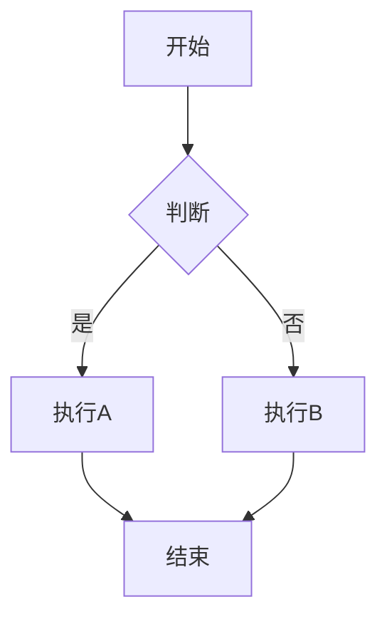
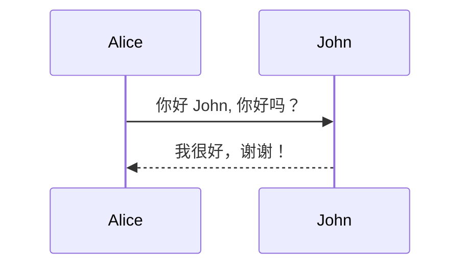
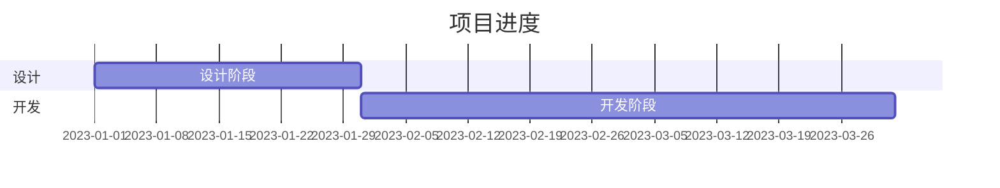
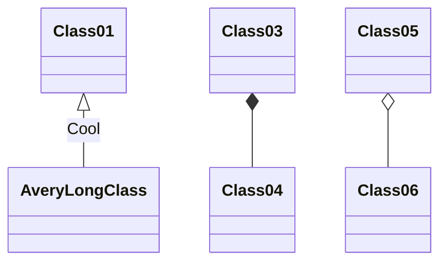
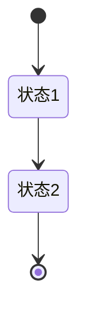
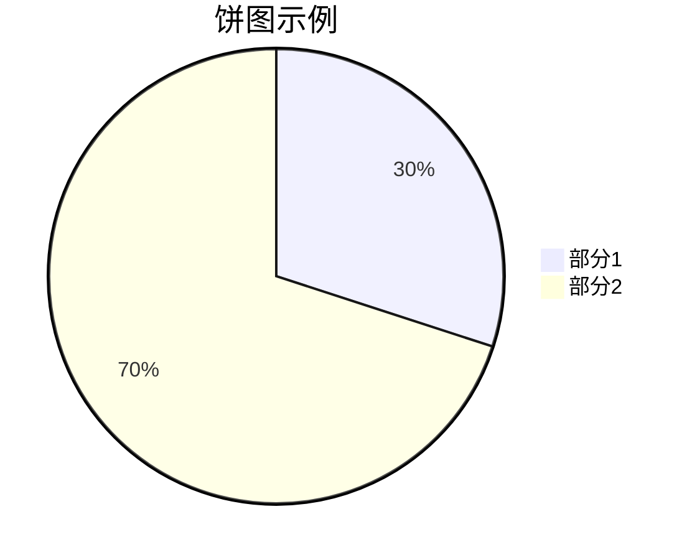

# 笔记

1. [CommonMark](https://commonmark.org/) 标准文档。
2. [GitHub Flavored Markdown (GFM)](https://github.github.com/gfm/) 标准文档。

# 语法

## 标题

行首井号，后跟一个空格：`# 标题`。

### 链接到标题

在标题后面使用大括号，大括号中写 ID，形如：`# title {#id}`，链接中可指定标题：`[title](#id)`。

## 段落

一个或多个空白行。

## 换行

行尾两个空格。

## 强调

### 加粗

文本前后两个星号：`**文本**`。

### 斜体

文本前后一个星号：`*文本*`。

### 粗斜体

文本前后三个星号：`***文本***`。

### 删除线

文本两边两个波浪线：`~~文本~~`。

## 引用

行首左尖括号，后跟一个空格：`> 文本`。

### 块引用

每行行首左尖括号。在其中可以结合使用代码块和列表。

```markdown
> 文本
>
> 文本
```

### 嵌套块引用

块引用行首再加一个左尖括号。

```markdown
> 文本
>
> > 文本
```

## 列表

### 有序列表

行首数字 1，后跟小数点和空格：`1. 文本`。

### 无序列表

行首中划线，后跟一个空格：`- 文本`。

### 列表中可使用其他语法

使用四个空格或一个制表符缩进，代码块需要八个空格或两制表符缩进。

## 代码

### 小段代码

文本前后一个或多个反引号：`` `文本` ``。

### 代码块

- 行首缩进四个空格或者一个制表符。

- 使用三个反引号包围也可以形成代码块，并可在前反引号后指定一种语言。

    ```markdown
    ​```golang
    文本
    ​```
    ```

#### Mermaid 图

##### 流程图

```markdown
​```mermaid
graph TD;
    A[开始] --> B{判断};
    B -->|是| C[执行A];
    B -->|否| D[执行B];
    C --> E[结束];
    D --> E;
​```
```



##### 序列图

```markdown
​```mermaid
sequenceDiagram;
    Alice->>John: 你好 John, 你好吗？
    John-->>Alice: 我很好，谢谢！
​```
```



##### 甘特图

```markdown
​```mermaid
gantt
    title 项目进度
    dateFormat  YYYY-MM-DD
    section 设计
    设计阶段 :a1, 2023-01-01, 30d
    section 开发
    开发阶段 :after a1, 60d
​```
```



##### 类图

```markdown
​```mermaid
classDiagram
    Class01 <|-- AveryLongClass : Cool
    Class03 *-- Class04
    Class05 o-- Class06
​```
```



##### 状态图

```markdown
stateDiagram-v2
    [*] --> 状态1
    状态1 --> 状态2
    状态2 --> [*]
```



##### 饼图

```markdown
pie
    title 饼图示例
    "部分1": 30
    "部分2": 70
```



## 分割线

一行三个下划线：`___`

## 链接

语法：`[超链接显示名](超链接地址 "超链接 title")`。  
可将网址和电子邮箱号使用尖括号包围，变成可点击链接：`<ivfzhou@126.com>`。

### 引用型链接

由两部分组成，第一部分有两个中括号，第一个中括号包围应显示为链接的文本，第二个中括号指向链接：`[超链接显示名][1]`。  
第二部分由中括号，后跟冒号和空格，再后面是链接和双引号括起来的标题：`[1]: http://ivfzhou.cn "title"`。

### 图片链接

语法：``。  
图片形式的链接：`[](链接)`。

## 表格

三个中划线生成列，一个管道符生成行，使用冒号表示对齐方式。表格中的 `|` 符号需要转义。  
语法：

```markdown
|  |  |
| :---: | :---: |
|  |  |
```

## HTML

文本中编写 HTML 代码将被解释。
